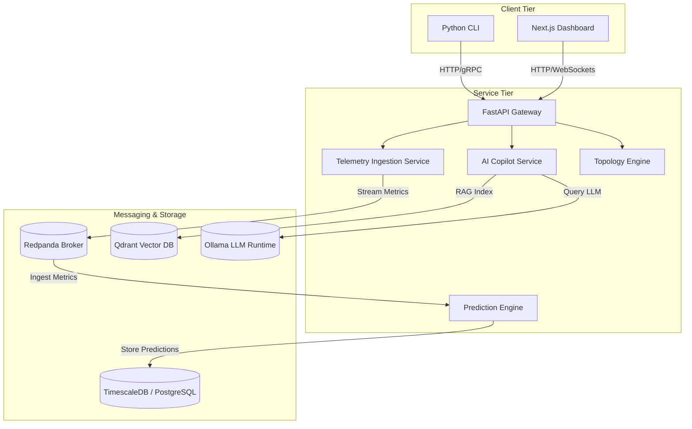

# Plutopus

Plutopus is a self-hosted AI-powered Predictive NOC Copilot for SD-WAN/MPLS networks. It reduces Mean Time to Resolution (MTTR) by tracking network topologies, correlating alarms, predicting tunnel/path degradations before they disrupt traffic, and providing an interactive diagnostic Copilot.

---

## Architecture Overview


```mermaid
graph TD
    subgraph Client Tier
        CLI[Python CLI]
        Dashboard[Next.js Dashboard]
    end

    subgraph Service Tier
        API[FastAPI Gateway]
        Telemetry[Telemetry Ingestion Service]
        Prediction[Prediction Engine]
        Copilot[AI Copilot Service]
        Topology[Topology Engine]
    end

    subgraph Messaging & Storage
        Redpanda[(Redpanda Broker)]
        Postgres[(TimescaleDB / PostgreSQL)]
        Qdrant[(Qdrant Vector DB)]
        Ollama[(Ollama LLM Runtime)]
    end

    CLI -->|HTTP/gRPC| API
    Dashboard -->|HTTP/WebSockets| API

    API --> Telemetry
    API --> Topology
    API --> Copilot

    Telemetry -->|Stream Metrics| Redpanda
    Redpanda -->|Ingest Metrics| Prediction
    Prediction -->|Store Predictions| Postgres
    Copilot -->|RAG Index| Qdrant
    Copilot -->|Query LLM| Ollama
```

---

## Tech Stack

- **Backend**: Python 3.12, FastAPI, SQLAlchemy, Pydantic
- **Frontend**: Next.js 15, TypeScript, TailwindCSS, shadcn/ui
- **Database**: PostgreSQL with TimescaleDB
- **Vector Database**: Qdrant
- **Messaging**: Redpanda (Kafka compatibility)
- **AI Runtime**: Ollama (Local & Air-Gapped)
- **Infrastructure**: Docker, Docker Compose

---

## Folder Structure

```
plutopus/
├── apps/
│   ├── api/          # FastAPI Gateway Backend
│   ├── dashboard/    # Next.js Frontend Dashboard
│   └── cli/          # Typer-based CLI
├── services/
│   ├── telemetry/    # Telemetry Ingestion Service
│   ├── prediction/   # Anomaly Forecast Engine
│   ├── copilot/      # RAG & Local Agent service
│   └── topology/     # Network Graph Engine
├── packages/
│   ├── shared/       # Shared common libraries
│   ├── schemas/      # Shared Pydantic contracts
│   └── utils/        # Common scripts & helpers
├── infrastructure/   # Docker, Compose overlays & Monitoring
├── docs/             # Architecture, Roadmaps, & ADRs
├── Makefile          # Local DX tasks
└── README.md
```

---

## Local Setup

### Prerequisites
- Docker & Docker Compose
- Node.js 20+
- Python 3.12+

### Running the Stack
1. Clone the repository and navigate to the directory:
   ```bash
   git clone https://github.com/ayushkumar2601/Plutopus.git
   cd Plutopus
   ```
2. Copy environment variables:
   ```bash
   cp .env.example .env
   ```
3. Spin up the infrastructure, API, and Dashboard:
   ```bash
   make dev
   ```

### Access Ports
- **Dashboard**: [http://localhost:3000](http://localhost:3000)
- **FastAPI OpenAPI Docs**: [http://localhost:8000/docs](http://localhost:8000/docs)
- **FastAPI Health Endpoint**: [http://localhost:8000/health](http://localhost:8000/health)

---

## Roadmap

- **Phase 1: Foundation & Telemetry** (In Progress)
- **Phase 2: Topology & Network Intelligence**
- **Phase 3: Predictive Analytics**
- **Phase 4: AI Copilot**
- **Phase 5: Workflow Automation**
- **Phase 6: Air-Gapped Platform**
