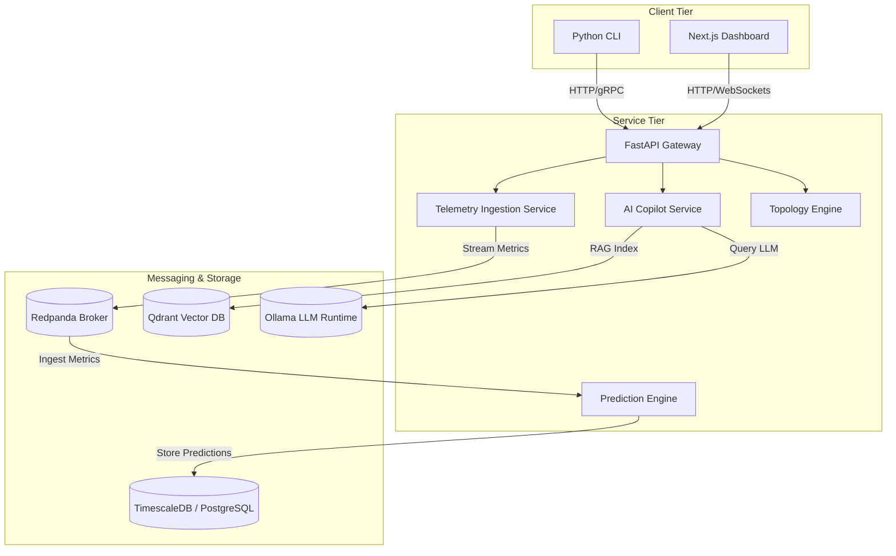

# System Overview: Plutopus

Plutopus is a self-hosted AI-powered Predictive NOC Copilot designed for SD-WAN and MPLS networks. It monitors, visualizes, predicts, and diagnoses network anomalies and link degradations.

## System Vision

SD-WAN and MPLS networks produce vast amounts of telemetry, alerts, and topology information. Traditional Network Operations Centers (NOCs) rely on human troubleshooting to resolve complex incidents, leading to high Mean Time to Resolution (MTTR). Plutopus serves as a local, private copilot that:
1. **Aggregates Telemetry**: Ingests real-time interface metrics, tunnel latency, packet loss, and jitter.
2. **Predicts Failure**: Forecasts path degradation before traffic experiences failures.
3. **Automates Diagnostic Loops**: Investigates topology charts, correlates alerts, and recommends mitigation actions.
4. **Ensures Air-Gapped Compliance**: Runs AI models and indexing entirely self-hosted to comply with strict enterprise compliance standards.

## High-Level Architecture

The platform operates as a multi-tier, event-driven system built on a monorepo structure.

## Service Boundaries

### 1. API Application (`apps/api`)
Acts as the central gateway and HTTP orchestration layer. It exposes REST and WebSocket interfaces for the CLI and frontend dashboard.

### 2. Dashboard (`apps/dashboard`)
React-based graphical user interface presenting network maps, real-time alert widgets, timeline charts, and chat assistant window.

### 3. Telemetry Service (`services/telemetry`)
Inbound pipeline for SNMP, gNMI, NetFlow, and SD-WAN controller webhooks. Directs metrics to Redpanda.

### 4. Prediction Engine (`services/prediction`)
Monitors Redpanda streams, runs time-series forecast models, and alerts when anomaly probability exceeds thresholds.

### 5. AI Copilot (`services/copilot`)
Maintains vector databases of runbooks and network manuals, orchestrates agents using local LLMs via Ollama, and solves network diagnoses.

### 6. Topology Engine (`services/topology`)
Calculates network graph layouts, tracks tunnels, and detects path changes.

## Future Components
- **Agentic Actions Engine**: To safely push routing updates, apply QoS rules, and interface with SD-WAN APIs.
- **Explainable Anomaly Explainer**: Generates natural language summaries explaining *why* a tunnel path was predicted to degrade.
