# Plutopus Platform Bible
### The Definitive Technical Reference — Version 1.0

---

> **Document Status**: Canonical · Version 1.0.0 · Built from complete repository audit
> **Audience**: Engineers · Operators · Architects · Security Reviewers · Future Contributors
> **Last Updated**: 2026-06-30

---

## Table of Contents

1. [Executive Summary](#1-executive-summary)
2. [Product Vision](#2-product-vision)
3. [Platform Overview](#3-platform-overview)
4. [Complete Repository Structure](#4-complete-repository-structure)
5. [Architecture Deep Dive](#5-architecture-deep-dive)
6. [System Architecture Diagrams](#6-system-architecture-diagrams)
7. [Data Flow Documentation](#7-data-flow-documentation)
8. [Database Architecture](#8-database-architecture)
9. [API Documentation](#9-api-documentation)
10. [Telemetry Architecture](#10-telemetry-architecture)
11. [Topology Engine](#11-topology-engine)
12. [Prediction Engine](#12-prediction-engine)
13. [Correlation Engine](#13-correlation-engine)
14. [AI Copilot](#14-ai-copilot)
15. [Incident Management](#15-incident-management)
16. [Security Architecture](#16-security-architecture)
17. [Air-Gap Architecture](#17-air-gap-architecture)
18. [Monitoring and Observability](#18-monitoring-and-observability)
19. [Deployment Guide](#19-deployment-guide)
20. [Backup and Recovery](#20-backup-and-recovery)
21. [Capacity Planning](#21-capacity-planning)
22. [Operational Runbooks](#22-operational-runbooks)
23. [Development Guide](#23-development-guide)
24. [Testing Strategy](#24-testing-strategy)
25. [Performance Characteristics](#25-performance-characteristics)
26. [Production Readiness Assessment](#26-production-readiness-assessment)
27. [Phase-by-Phase Journey](#27-phase-by-phase-journey)
28. [Future Roadmap](#28-future-roadmap)
29. [Glossary](#29-glossary)
30. [Final Platform Summary](#30-final-platform-summary)

---

## 1. Executive Summary

### What Is Plutopus?

Plutopus is an **AI-powered, self-hosted, air-gap-ready Network Operations Intelligence Platform** purpose-built for SD-WAN and MPLS enterprise networks. It is a complete, end-to-end system that ingests live network telemetry, builds a real-time topology model of every site, device, interface, and tunnel in the network, applies predictive analytics to forecast degradation up to 60 minutes ahead, correlates anomalies into actionable incidents using topology context, and provides a natural language AI Copilot that can answer complex network diagnostic questions grounded entirely in live platform data.

### Why It Was Built

Traditional Network Operations Centers (NOCs) operate reactively. An outage begins, alarms fire, operators scramble to correlate alerts from disparate monitoring systems, manually trace through topology diagrams, and eventually identify the root cause — often 30 to 90 minutes after the problem began. This model is fundamentally broken for modern enterprise SD-WAN and MPLS networks where thousands of tunnel paths, dozens of sites, and complex underlay/overlay relationships create immense diagnostic complexity.

| Problem | Impact | Plutopus Solution |
|---------|--------|-------------------|
| Reactive alerting | Outages diagnosed after they begin | Forecasting 15m / 30m / 60m ahead using linear trend models |
| Alert fatigue | Hundreds of individual alarms per incident | Topology-aware correlation groups anomalies into single incidents |
| No topology context | Root cause unclear without network map | NetworkX graph model: sites to devices to interfaces to tunnels |
| Manual investigation | MTTR measured in hours | AI Copilot answers diagnostic questions in seconds |
| Vendor AI dependency | Cloud LLMs leak sensitive topology data | Fully local Ollama LLM runtime, zero external calls |
| Air-gap compliance | Enterprise networks cannot reach internet | Complete offline bundle with models, runbooks, and images |

### Target Environments

- **Enterprise WAN operations** with SD-WAN or MPLS overlay networks
- **Government and defence networks** operating in air-gapped or classified environments
- **Managed service providers (MSPs)** operating NOC services for multiple enterprise customers
- **Critical infrastructure operators** requiring predictive failure detection and immutable audit trails

### Target Users

| Role | What They Use |
|------|---------------|
| **NOC Operator** | Dashboard topology map, incident list, copilot chat |
| **Network Engineer** | Predictions panel, anomaly timeline, path analysis |
| **NOC Manager** | Risk score dashboards, capacity reports, audit logs |
| **Platform Administrator** | API management, user role assignment, backup execution |
| **Security Auditor** | Audit log trail, compliance reports, RBAC verification |

### Business Value

- **Reduced MTTR**: Proactive forecasting and topology-aware root cause analysis reduce mean time to resolution from hours to minutes.
- **Reduced alert fatigue**: Correlation engine collapses hundreds of individual anomaly alerts into single, prioritised incidents.
- **Air-gap compliance**: Deployable with zero internet connectivity, meeting the strictest classified network requirements.
- **Zero vendor lock-in**: Fully open-source stack — FastAPI, PostgreSQL/TimescaleDB, Redpanda, Ollama, NetworkX — no licensing fees.
- **AI-native operations**: Natural language querying of live network state replaces manual dashboard exploration.

### Technical Value

- **End-to-end streaming architecture**: Telemetry flows from Telegraf through Redpanda into normalised database records in under one second.
- **Pure Python ML**: Forecasting uses dependency-free linear regression with Z-score anomaly detection — no heavy ML runtime required.
- **Graph-native topology**: NetworkX directed graph enables shortest-path computation, centrality analysis, and neighbor traversal at query time.
- **Structured AI grounding**: Copilot responses are grounded in live telemetry context and curated runbooks — hallucination-resistant by design.

---

## 2. Product Vision

### Reactive NOC vs. Predictive NOC

A **Reactive NOC** waits for failure. The monitoring system generates an alert. An operator sees it, opens a ticket, begins manual investigation, reviews dashboards, contacts affected site teams, traces through network maps, and eventually identifies the root cause. By the time resolution occurs, the network has been degraded for 30 to 120 minutes.

A **Predictive NOC** detects the pattern of impending failure before it becomes an outage. The platform identifies that packet loss on three tunnels terminating at the same hub site is trending upward at a rate that, extrapolated 30 minutes forward, will breach the critical threshold. It generates an incident, prioritises it by the business criticality of the affected sites, recommends runbook procedures, and surfaces the diagnosis to the operator — before a single user call is received.

Plutopus implements the Predictive NOC model.

### Why Telemetry Alone Is Insufficient

Raw telemetry tells you a metric is high. It does not tell you:
- Which other entities share the same underlay and are therefore at correlated risk
- Whether this metric has been trending for 5 minutes or 5 hours
- Whether a similar pattern preceded an outage 3 weeks ago
- What the most likely root cause is given the topology
- What steps an experienced engineer would take to diagnose this specific failure mode

Plutopus adds the intelligence layer above raw telemetry to answer all of these questions.

### Why Topology Awareness Matters

In SD-WAN and MPLS networks, a single hub site failure cascades through every spoke connected to it. Without a topology model, an operator sees dozens of individual spoke alarms and treats them as individual failures. With topology awareness, the platform immediately identifies that all of these spokes share the same upstream hub, correlates the anomalies into a single root-cause incident pointing at the hub, and eliminates the false impression of 30 simultaneous failures.

Plutopus uses a directed graph model (NetworkX DiGraph) that maps the full hierarchy: Site to Device to Interface to Tunnel. Every relationship in the network is an edge in this graph. Path analysis, neighbor discovery, and site aggregation are all first-class graph operations.

### Why Forecasting Matters

A threshold-based alert fires when a metric exceeds a level that has already been configured as critical. By definition, the system is already in a degraded state when the alert fires.

Forecasting fires before the threshold is breached. If latency on a tunnel is 45ms now but trending at +8ms per interval, a 30-minute forecast will project it at 93ms — above the 80ms warning threshold. Plutopus generates a warning anomaly now, while there is still time to take preventive action.

The linear trend model used by Plutopus (`forecast_metric()`) projects values at +15m, +30m, and +60m windows with an associated confidence score. The model is dependency-free (pure Python arithmetic), runs in milliseconds, and produces interpretable outputs that operators can trust.

### Why AI Copilots Matter

A network engineer facing an incident must gather context from four or five different tools: a monitoring dashboard for raw metrics, a topology diagram tool for network map context, a ticketing system for incident history, a knowledge base for runbook procedures, and a configuration management system for device state. This tool-switching takes time and introduces error.

The Plutopus Copilot collapses this workflow. An operator can ask a natural language question. The Copilot retrieves the site risk score, active anomalies, connected neighbors, and forecasted tunnel states from the database, pairs this with the relevant troubleshooting runbook, constructs a grounded prompt, sends it to the local Ollama runtime, and returns a professional markdown response with source attribution — all within 4 seconds.

### Why Air-Gap Support Matters

Many enterprise networks — government agencies, defence contractors, financial regulators, critical infrastructure operators — cannot connect their NOC platforms to the internet. Plutopus was designed from Phase 1 to support full air-gap deployment:
- All Docker images are bundleable into a single tar archive
- Ollama models are pre-downloaded and packaged into the offline bundle
- Runbooks are static markdown files — no network access required
- The entire platform functions with `AIRGAP_MODE=true` and no external connectivity whatsoever

---

## 3. Platform Overview

### Major Subsystems

| Subsystem | Primary Role | Technology |
|-----------|--------------|------------|
| **API Gateway** (apps/api) | REST API, authentication, RBAC, audit logging | FastAPI, Python |
| **Dashboard** (apps/dashboard) | Web UI: topology map, predictions, copilot chat | Next.js 15, TypeScript |
| **CLI** (apps/cli) | Terminal interface for operator commands | Python, Click |
| **Telemetry Service** (services/telemetry) | Kafka consumer, metric normalisation, DB ingestion | Python, kafka-python |
| **Prediction Engine** (services/prediction) | Forecasting, anomaly detection, risk scoring | Pure Python |
| **Copilot Service** (services/copilot) | LLM integration, context assembly, runbook retrieval | Python, Ollama |
| **Topology Engine** (services/topology) | Graph model, path analysis, health computation | NetworkX, Python |

### Cross-Cutting Shared Packages

| Package | Role |
|---------|------|
| packages/shared | SQLAlchemy models, database session, shared utilities |
| packages/schemas | Pydantic response schemas used across API and services |
| packages/utils | Shared helper functions |

### Infrastructure Components

| Component | Role | Port |
|-----------|------|------|
| **TimescaleDB / PostgreSQL 16** | Primary time-series database | 5432 |
| **Redpanda** | Kafka-compatible streaming message broker | 9092 (internal), 19092 (external) |
| **Qdrant** | Vector database (provisioned, available for RAG expansion) | 6333 |
| **Ollama** | Local LLM runtime | 11434 |
| **Prometheus** | Metrics collection | 9090 |
| **Grafana** | Metrics visualisation | 3001 |

### Design Principles

1. **Event-driven by default**: Telemetry does not flow directly from devices to the database. It passes through Redpanda, enabling reliable delivery, backpressure handling, and consumer group scaling.
2. **Topology-first intelligence**: Every analytical decision — risk scoring, correlation, copilot context — is topology-aware. The graph model is the foundation of all intelligence.
3. **Air-gap as a first-class requirement**: All external dependencies are replaceable with locally-hosted alternatives. No feature degrades when network access is removed.
4. **Deterministic fallbacks**: Every AI-powered feature has a structured, deterministic fallback. If Ollama is unreachable, the Copilot generates a grounded markdown summary from database state alone.
5. **Monorepo coherence**: All services, apps, and packages share a single repository, enabling atomic changes, shared CI, and consistent dependency management.
6. **Pydantic validation at every boundary**: All API inputs and outputs are validated through Pydantic models, preventing injection and ensuring contract consistency.

### Architectural Philosophy

Plutopus follows a **tiered, event-driven, graph-enriched** architecture:

```
Presentation Tier  →  API Tier  →  Intelligence Tier  →  Storage Tier  →  Streaming Tier
```

Each tier is independently deployable and scalable. The streaming tier (Redpanda) decouples telemetry producers from consumers. The storage tier (TimescaleDB) provides both relational consistency and time-series optimisation. The intelligence tier (Prediction, Topology, Copilot, Correlation) operates as independent workers consuming from shared storage. The API tier is the single gateway through which all external clients access platform capabilities.

---

## 4. Complete Repository Structure

```
plutopus/
├── apps/                           # User-facing applications
│   ├── api/                        # FastAPI REST Gateway
│   │   ├── Dockerfile
│   │   ├── alembic.ini             # Database migration configuration
│   │   ├── migrations/             # Alembic migration scripts
│   │   ├── pyproject.toml
│   │   └── src/
│   │       ├── main.py             # Application entrypoint, FastAPI app instantiation
│   │       ├── api/
│   │       │   └── v1/
│   │       │       ├── router.py   # API router mounting all endpoint groups
│   │       │       └── endpoints/
│   │       │           ├── audit.py        # Audit log retrieval (admin only)
│   │       │           ├── copilot.py      # AI Copilot chat, explain, incident summary
│   │       │           ├── devices.py      # Device inventory list
│   │       │           ├── events.py       # Syslog/event retrieval
│   │       │           ├── health.py       # Platform liveness check
│   │       │           ├── incidents.py    # Incident CRUD, correlation trigger, export
│   │       │           ├── metrics.py      # Raw telemetry metric retrieval
│   │       │           ├── predictions.py  # Forecasts, anomalies, risk scores
│   │       │           ├── sites.py        # Site inventory list
│   │       │           ├── topology.py     # Graph, path, neighbors, intelligence
│   │       │           └── tunnels.py      # Tunnel inventory list
│   │       └── core/
│   │           ├── auth.py         # JWT creation, validation, key rotation, RBAC
│   │           ├── audit.py        # Audit log writer helper
│   │           ├── config.py       # Pydantic settings (env-driven configuration)
│   │           └── metrics.py      # Prometheus counters, histograms, middleware
│   ├── cli/                        # Python CLI client
│   │   ├── Dockerfile
│   │   ├── pyproject.toml
│   │   └── src/
│   │       ├── main.py             # CLI entrypoint
│   │       ├── client/             # HTTP client for API communication
│   │       └── commands/
│   │           └── health.py       # `plutopus health` command
│   └── dashboard/                  # Next.js 15 Web Dashboard
│       ├── Dockerfile
│       ├── package.json
│       ├── next.config.ts
│       ├── tsconfig.json
│       └── src/
│           ├── app/                # Next.js App Router pages
│           ├── components/         # React components
│           └── lib/                # Shared utilities and API clients
│
├── services/                       # Backend intelligence microservices
│   ├── copilot/                    # AI Copilot Service
│   │   ├── Dockerfile
│   │   ├── context/
│   │   │   ├── engine.py           # Site/tunnel context assembly from database
│   │   │   └── summarizer.py       # Natural language incident summarisation
│   │   ├── llm/
│   │   │   └── __init__.py         # Ollama HTTP client, fallback generator
│   │   ├── memory/
│   │   │   └── __init__.py         # Session-scoped conversation memory manager
│   │   ├── prompts/
│   │   │   └── __init__.py         # System prompt and analyst template
│   │   ├── retrieval/
│   │   │   └── __init__.py         # Keyword-based runbook retrieval
│   │   └── runbooks/               # Markdown troubleshooting runbooks
│   │       ├── congestion.md
│   │       ├── high_latency.md
│   │       ├── interface_flapping.md
│   │       ├── packet_loss.md
│   │       ├── route_instability.md
│   │       └── tunnel_failure.md
│   ├── correlation/                # Event Correlation Engine
│   │   ├── engine.py               # Topology-aware anomaly grouping into incidents
│   │   └── prioritization.py       # Multi-factor incident priority scoring
│   ├── integrations/               # External Integration Service
│   │   └── webhooks.py             # Outbound webhook dispatcher with retry logic
│   ├── prediction/                 # Predictive Analytics Engine
│   │   ├── Dockerfile
│   │   ├── anomaly/
│   │   │   └── __init__.py         # Z-score anomaly detection
│   │   ├── forecasting/
│   │   │   └── __init__.py         # Linear regression forecasting engine
│   │   ├── risk/
│   │   │   └── __init__.py         # Tunnel and site risk scoring formulas
│   │   └── src/
│   │       └── worker.py           # Main prediction pipeline loop worker
│   ├── telemetry/                  # Telemetry Ingestion Service
│   │   ├── Dockerfile
│   │   └── src/
│   │       ├── main.py             # Kafka consumer main loop
│   │       └── normalizers/
│   │           └── __init__.py     # Metric and event payload normalisation
│   └── topology/                   # Topology Engine
│       ├── topology.yaml           # Lab topology definition (sites, devices, tunnels)
│       ├── seed.py                 # Database seeder from topology.yaml
│       ├── graph/
│       │   └── __init__.py         # NetworkX DiGraph construction from database
│       ├── health/
│       │   └── __init__.py         # Interface, tunnel, site, network health calculators
│       ├── intelligence/
│       │   └── __init__.py         # Centrality analysis, critical link detection
│       └── repository/
│           └── __init__.py         # Topology data access layer
│
├── packages/                       # Shared packages
│   ├── schemas/                    # Pydantic shared schemas
│   ├── shared/                     # Core shared library
│   │   └── src/
│   │       └── plutopus_shared/
│   │           ├── __init__.py     # Public package exports
│   │           ├── correlation.py  # Shared metric correlation helpers
│   │           ├── db.py           # SQLAlchemy engine, session factory, Base
│   │           └── models.py       # All SQLAlchemy ORM models (11 tables)
│   └── utils/                      # Shared utilities
│
├── infrastructure/                 # Deployment infrastructure
│   ├── helm/                       # Kubernetes Helm chart
│   │   ├── Chart.yaml              # Chart metadata (appVersion: 1.0.0)
│   │   ├── values.yaml             # Default Helm values
│   │   └── templates/
│   │       ├── deployment.yaml     # Kubernetes Deployment with health probes
│   │       └── service.yaml        # Kubernetes Service definition
│   └── monitoring/
│       ├── prometheus.yml          # Prometheus scrape configuration
│       ├── grafana/dashboards/     # Grafana dashboard JSON exports
│       └── telegraf/
│           └── telegraf.conf       # Telegraf SNMP + Kafka output configuration
│
├── distribution/                   # Air-gap distribution artifacts
│   ├── pack-offline-bundle.sh      # Offline bundle packing script
│   ├── checksums/                  # SHA-256 checksums for bundle integrity
│   ├── docker-images/              # Docker image tarballs for air-gap hosts
│   ├── models/                     # LLM model files for offline use
│   └── runbooks/                   # Runbooks copied into bundle
│
├── scripts/                        # Operational scripts
│   ├── airgap/verify.sh            # Air-gap deployment verification
│   ├── backup-validation/validate.sh # Backup integrity validation
│   ├── security-audit/audit.sh     # Security configuration audit
│   ├── upgrade/upgrade.sh          # Platform upgrade procedure
│   ├── upgrade/rollback.sh         # Rollback to previous version
│   ├── backup.sh                   # TimescaleDB pg_dump backup
│   ├── restore.sh                  # TimescaleDB pg_restore
│   ├── generate-demo-telemetry.py  # Kafka-based demo telemetry generator
│   └── init-redpanda.sh            # Redpanda topic initialisation script
│
├── docs/                           # Supplementary documentation
│   ├── adr/                        # Architecture Decision Records (5 ADRs)
│   ├── architecture/system-overview.md
│   ├── compliance/compliance-readiness.md
│   ├── operations/operational-excellence.md
│   ├── roadmap/phases.md
│   ├── runbooks/disaster-recovery.md
│   ├── capacity-planning.md
│   └── production-readiness.md
│
├── docker-compose.yml              # Complete platform Docker Compose stack (13 services)
├── Makefile                        # Developer convenience targets
├── .env.example                    # Environment variable template
├── README.md                       # Public-facing project README
└── documentation.md                # This document — Platform Bible
```

### Directory Ownership

| Directory | Owner | Notes |
|-----------|-------|-------|
| apps/api | Platform Team | Core API gateway, all REST routes |
| apps/dashboard | Frontend Team | Next.js dashboard |
| apps/cli | Platform Team | CLI tooling |
| services/telemetry | Data Pipeline Team | Kafka consumer worker |
| services/prediction | Analytics Team | Forecasting and anomaly detection |
| services/copilot | AI Team | LLM integration and context engine |
| services/topology | Network Intelligence Team | Graph model and health engine |
| services/correlation | Analytics Team | Incident correlation logic |
| services/integrations | Platform Team | Webhook dispatching |
| packages/shared | Platform Team | Core ORM models — change carefully |
| infrastructure/ | DevOps Team | All deployment configuration |
| distribution/ | DevOps Team | Air-gap bundle artifacts |
| scripts/ | DevOps / Platform Team | Operational automation |

---

## 5. Architecture Deep Dive

### 5.1 Telemetry Layer

**Purpose**: Accept raw network telemetry from collection agents and deliver normalised metric and event records into persistent storage.

**Responsibilities**:
- Consume messages from two Redpanda topics: `metrics_raw` and `events_raw`
- Normalise each raw payload into a structured `Metric` or `Event` ORM object
- Persist normalised records to TimescaleDB
- Generate periodic `TelemetrySnapshot` records for system health tracking
- Handle connection failures with retry logic (10 retries, 3s sleep)

**Inputs**: Raw JSON messages from `metrics_raw` and `events_raw` Kafka topics

**Outputs**: `Metric`, `Event`, and `TelemetrySnapshot` rows in TimescaleDB

**Dependencies**: Redpanda (Kafka API), TimescaleDB, `plutopus_shared` (models)

**Failure Modes**:
- **Redpanda unavailable**: Worker retries 10 times with 3-second intervals, then raises `RuntimeError` and exits. Container restart policy resumes the worker.
- **Database unavailable**: SQLAlchemy throws `OperationalError`. The database session is rolled back and the exception is logged. The message is effectively lost.
- **Invalid payload**: The normaliser returns `None`. The message is logged as a warning and skipped.

**Scaling**: The telemetry worker operates as a Kafka consumer group (`group_id="telemetry-worker-group"`). To scale, add more worker replicas — Redpanda automatically distributes partition ownership. One replica per 500 metrics/second is the recommended baseline.

---

### 5.2 Database Layer

**Purpose**: Provide persistent, time-series-optimised storage for all platform data.

**Technology**: TimescaleDB (PostgreSQL 16 with time-series extensions)

**Key Characteristics**:
- All ORM models defined in `packages/shared/src/plutopus_shared/models.py`
- Tables auto-created from SQLAlchemy model metadata on API startup via `Base.metadata.create_all()`
- Session factory pattern: `SessionLocal()` creates new sessions per request
- Foreign keys with `CASCADE` delete maintain referential integrity
- Indexed columns on frequently queried fields (`timestamp`, `target_id`, `entity_id`, `severity`)

**Failure Modes**: If PostgreSQL is unavailable, all services that require database sessions will fail their requests with 500 errors. The platform has no in-memory fallback for database state.

**Scaling**: For deployments above 5000 devices, configure TimescaleDB hypertable partitioning on the `metrics` and `forecasts` tables with `chunk_time_interval = '1 day'`.

---

### 5.3 Topology Layer

**Purpose**: Maintain a live, traversable graph model of the entire network topology.

**Graph Node Types**: `site`, `device`, `interface`, `tunnel`

**Graph Edge Types**:
- `SITE_CONTAINS_DEVICE`: site → device
- `DEVICE_BELONGS_TO_SITE`: device → site (back-link)
- `DEVICE_HAS_INTERFACE`: device → interface
- `INTERFACE_BELONGS_TO_DEVICE`: interface → device (back-link)
- `INTERFACE_CONNECTED_TO`: interface → interface (via tunnel)
- `TUNNEL_TERMINATES_AT`: tunnel → src interface, tunnel → dst interface

**Failure Modes**:
- Site not found in graph: Returns `{"error": "Site not found in graph"}`
- No path between sites: Returns `{"path": [], "hops": 0, "tunnels": []}`
- Disconnected graph: `nx.NetworkXNoPath` exception caught and handled

**Scaling**: The graph is rebuilt from the database on every topology request. For networks above 500 nodes, consider implementing a cached graph that is rebuilt on topology change events rather than on every request.

---

### 5.4 Prediction Layer

**Purpose**: Apply time-series analysis to stored telemetry data to produce forecasts, anomaly detections, and risk scores.

**Run cycle** (`PREDICTION_INTERVAL`, default 300 seconds):
1. Process all interfaces: utilisation forecasting + anomaly detection
2. Process all tunnels: latency + loss forecasting + anomaly detection + risk scoring
3. Process all sites: aggregated risk scoring
4. Commit all results in a single transaction

**Sub-Modules**:
- `forecasting/__init__.py`: `forecast_metric()` — linear trend regression, capped-minimum projections
- `anomaly/__init__.py`: `detect_anomaly()` — Z-score calculation with severity thresholds
- `risk/__init__.py`: `calculate_tunnel_risk()`, `calculate_site_risk()` — weighted scoring formulas

**Failure Modes**:
- Database error during run: Transaction is rolled back, error is logged, the next interval will retry
- No historical data for an entity: Forecasting returns zero values with 0.5 confidence
- Anomaly detection requires minimum 3 data points and returns `None` otherwise

---

### 5.5 Correlation Layer

**Purpose**: Group related anomalies into actionable incidents using topology context, and assign priority scores based on business criticality.

**Two Correlation Scenarios**:
1. **Hub-Spoke Cascade**: Hub anomaly + 2 or more spoke anomalies on the same metric
2. **Local Site Degradation**: 2 or more anomalies on the same site's interfaces

**Priority Score Formula**:
```
raw_score = (risk_score × 0.30) + (criticality_weight × 0.35) + (urgency_score × 0.20) + (node_score × 0.15)
final_score = round(raw_score × confidence)
```

Where:
- `criticality_weight`: low=10, medium=30, high=60, mission_critical=90
- `urgency_score`: 15m window=95, 30m=75, 60m=50, beyond=25
- `node_score`: min(100, affected_nodes × 20)

---

### 5.6 Copilot Layer

**Purpose**: Provide natural language diagnostic assistance grounded in live platform data, historical telemetry, and curated troubleshooting runbooks.

**Sub-Modules**:
- `context/engine.py`: `CopilotContextEngine` — assembles site/tunnel context dictionaries
- `context/summarizer.py`: `CopilotIncidentSummarizer` — converts context to natural language
- `llm/__init__.py`: `call_ollama()`, `generate_fallback_response()` — LLM integration
- `memory/__init__.py`: `CopilotMemoryManager` — session memory with 10-message rolling window
- `prompts/__init__.py`: `SYSTEM_PROMPT`, `ANALYST_TEMPLATE` — prompt engineering
- `retrieval/__init__.py`: `CopilotRetrievalService` — keyword-to-runbook matching, entity ID extraction
- `runbooks/`: Six markdown runbooks covering the most common SD-WAN failure modes

**AIRGAP_MODE**: When `AIRGAP_MODE=true`, the Ollama host must be a locally running container. The copilot functions identically — all context is assembled from local database state, and the LLM call goes to the local Ollama container. No external network call is ever made.

**Failure Handling**: If `call_ollama()` returns an empty string, `generate_fallback_response()` constructs a structured markdown response from pre-assembled context (confidence=0.75).

---

### 5.7 Monitoring Layer

**Prometheus Metrics** (exposed at `GET /metrics`):

| Metric | Type | Labels | Description |
|--------|------|--------|-------------|
| `api_requests_total` | Counter | method, endpoint, status | Total HTTP requests |
| `api_request_latency_seconds` | Histogram | method, endpoint | Request duration distribution |
| `prediction_jobs_total` | Counter | status | Forecasting job completions |
| `copilot_queries_total` | Counter | status | Copilot dialogue requests |
| `incidents_generated_total` | Counter | severity | Incidents created by correlation engine |
| `webhook_delivery_total` | Counter | status | Outbound webhook delivery results |

---

### 5.8 Security Layer

**Capabilities**:
- JWT token generation and validation with HS256 signing
- JWT key rotation support via `JWT_ROTATION_SECRETS` environment variable
- Key strength enforcement: minimum 32-character secret required at startup
- RBAC via `RoleChecker` dependency injection — three roles: `admin`, `operator`, `viewer`
- Immutable audit log writing via `AuditLog` model
- CORS configuration via `BACKEND_CORS_ORIGINS`
- Input validation via Pydantic models on all endpoints

---

### 5.9 Air-Gap Layer

**Components**:
- `distribution/pack-offline-bundle.sh`: Creates a `.tar.gz` containing all Docker images, Helm charts, runbooks, and configuration
- `distribution/checksums/`: SHA-256 integrity verification for bundle files
- `scripts/airgap/verify.sh`: Validates that an air-gap deployment is correctly isolated
- `AIRGAP_MODE=true` environment variable: Prevents any outbound network calls in copilot service

---

## 6. System Architecture Diagrams

### 6.1 Logical Architecture

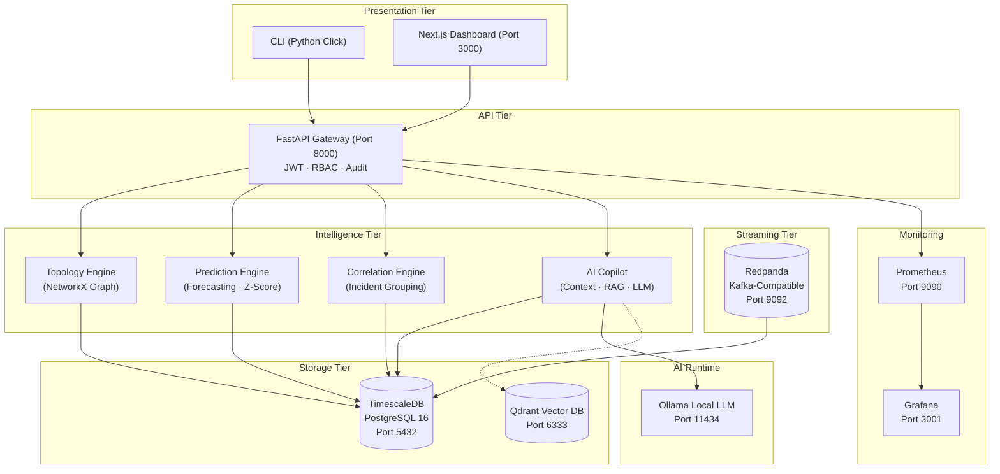

### 6.2 Prediction Pipeline

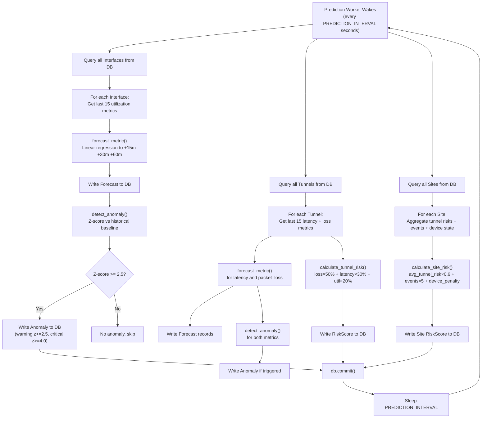

### 6.3 Copilot Pipeline

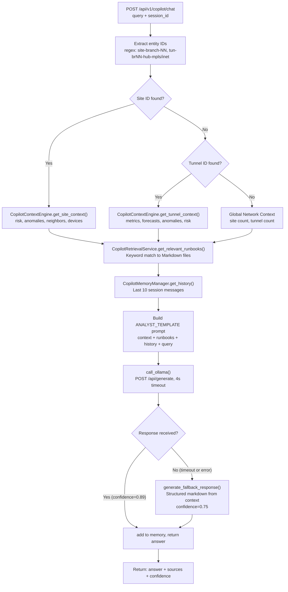

### 6.4 Incident Correlation Pipeline

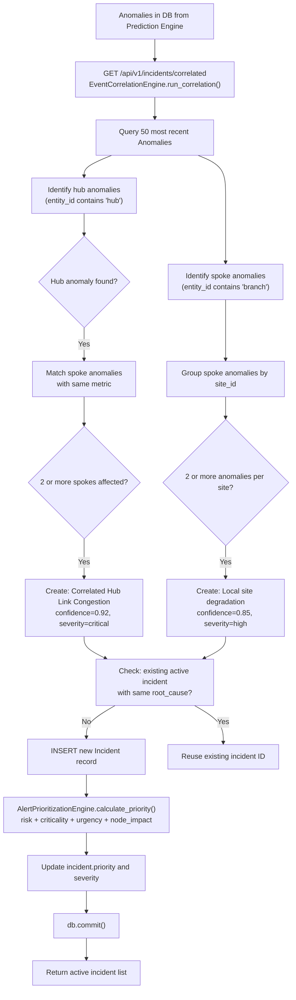

### 6.5 Authentication Flow

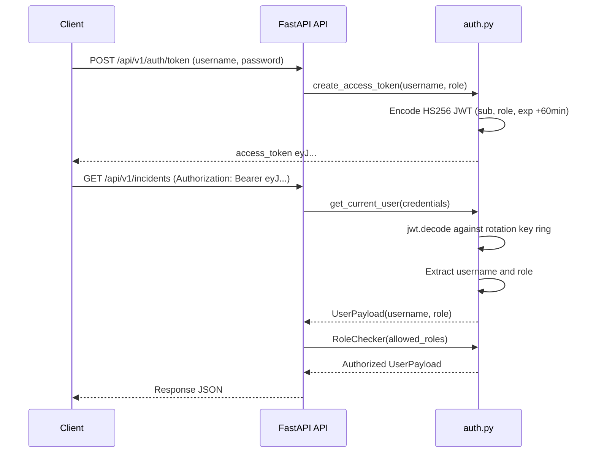

### 6.6 Air-Gap Deployment Architecture

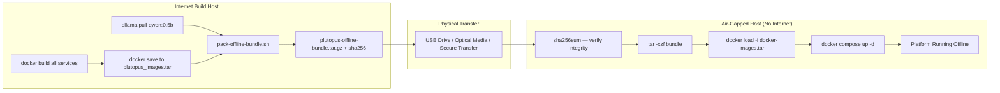

### 6.7 Data Tier

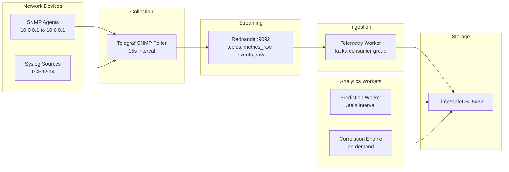

### 6.8 Service Communication Sequence

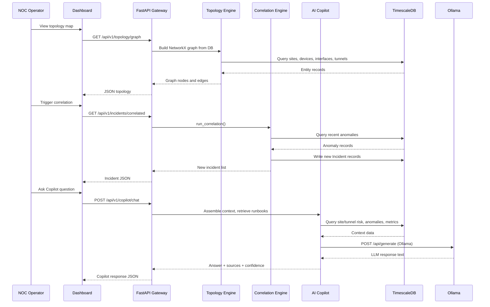

### 6.9 Deployment Architecture

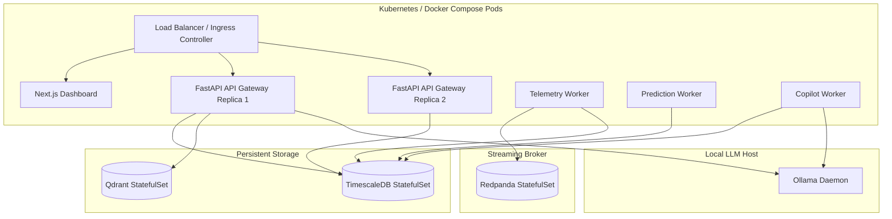

### 6.10 Backup & Recovery Flow

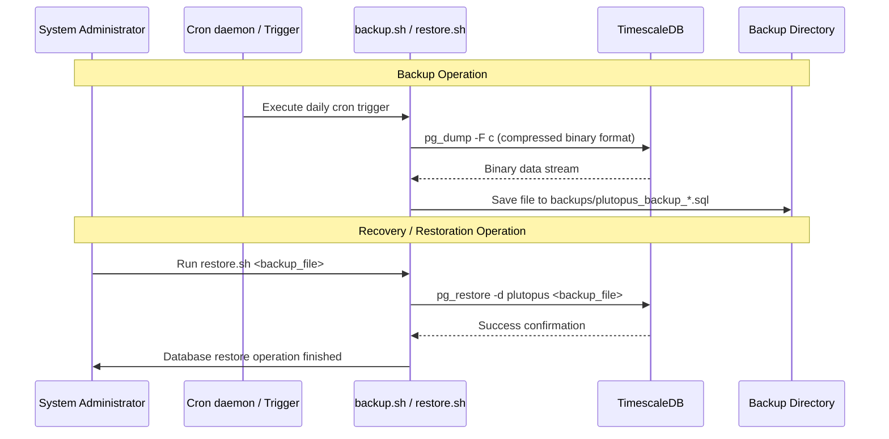

### 6.11 Audit Logging Flow

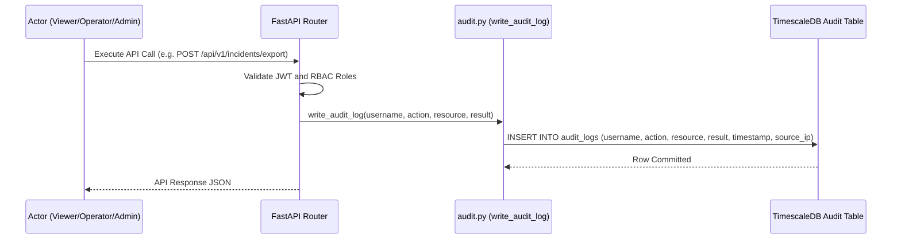

---


## 7. Data Flow Documentation

### 7.1 Telemetry Ingestion Flow

```
[Network Device]
     | SNMP v2c (15s interval)
     ▼
[Telegraf Collector]
     | JSON payload → Kafka topic: metrics_raw
     ▼
[Redpanda Message Broker]
     | Consumer group: telemetry-worker-group
     ▼
[Telemetry Worker (services/telemetry/src/main.py)]
     | normalize_metric(payload) → {target_id, name, value, timestamp}
     ▼
[TimescaleDB — metrics table]
     | target_id: interface or tunnel ID
     | name: latency, packet_loss, utilization
     | value: float
     | timestamp: datetime
     ▼
[Prediction Worker reads last 15 metric rows per entity every 300s]
```

### 7.2 End-to-End Data Lifecycle

```
Raw SNMP Poll
 |→ Telegraf formats as JSON
      |→ Pushed to metrics_raw Kafka topic
           |→ Telemetry Worker consumes message
                |→ normalize_metric() validates and cleans payload
                     |→ Metric ORM object inserted into DB
                          |→ Prediction Worker (on next interval):
                               |→ Queries last 15 Metric rows per entity
                                    |→ forecast_metric() writes Forecast row
                                    |→ detect_anomaly() writes Anomaly row if triggered
                                    |→ calculate_tunnel_risk() writes RiskScore row
                                         |→ Copilot reads risk + anomaly context
                                              |→ Correlation engine groups anomalies
                                                   |→ Incident row created
```

### 7.3 Metric to Incident Lifecycle

| Stage | Data Produced | Table |
|-------|--------------|-------|
| Raw telemetry | Raw JSON from SNMP | Kafka topic only |
| Normalisation | target_id, name, value, timestamp | metrics |
| Forecasting | current_val, forecast_15m, 30m, 60m, confidence | forecasts |
| Anomaly Detection | entity_id, entity_type, metric, severity, score, description | anomalies |
| Risk Scoring | entity_id, entity_type, risk_score, risk_level, signals | risk_scores |
| Correlation | title, description, severity, root_cause, affected_entities, priority | incidents |
| Copilot | Natural language diagnostic summary | API response only |

### 7.4 Telemetry State Simulation

The demo generator (`scripts/generate-demo-telemetry.py`) cycles through 8 distinct network states every 20 ticks:

| State | Latency Mult | Loss Mult | Util Base | Description |
|-------|-------------|-----------|-----------|-------------|
| NORMAL | 1.0x | 0.05x | 35% | Baseline healthy network |
| TRAFFIC_SURGE | 1.2x | 0.1x | 85% | Bandwidth spike event |
| CONGESTION | 1.8x | 1.5x | 92% | Sustained congestion |
| LATENCY_DRIFT | +0.3x per tick | 1.0x | 35% | Gradual latency degradation |
| PACKET_LOSS_BURST | 1.0x | 12.0x | 35% | Sudden loss burst |
| TUNNEL_FAILURE | 10.0x | 20.0x | 35% | Full tunnel failure simulation |
| INTERFACE_FLAPPING | 1.0x | 1.0x | 15–95% | Interface up/down alternation |
| DEGRADATION | 4.0x | 5.0x | 50% | General degradation |

---

## 8. Database Architecture

### 8.1 Entity Relationship Overview

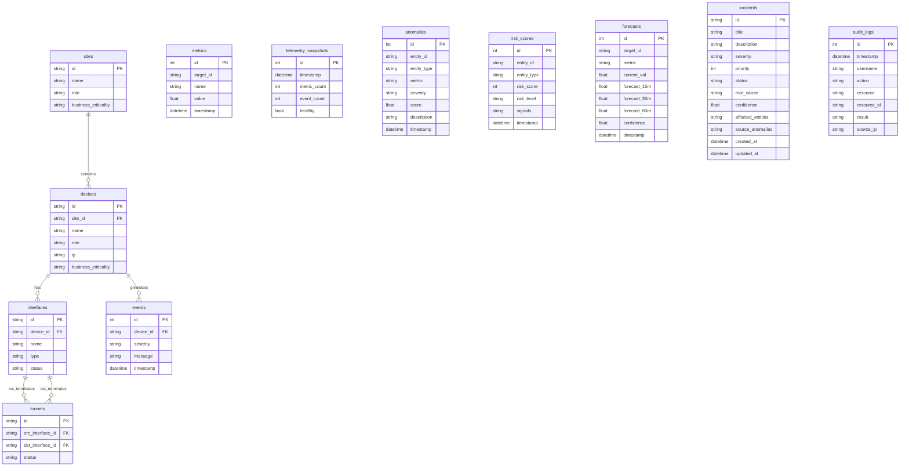

### 8.2 Table Reference

#### Table: sites

| Column | Type | Constraints | Description |
|--------|------|-------------|-------------|
| id | String | PK, indexed | Unique site identifier e.g. `site-hub`, `site-branch-01` |
| name | String | NOT NULL | Human-readable site name |
| role | String | NOT NULL | Network role: `hub` or `spoke` |
| business_criticality | String | NOT NULL, default `medium` | `low`, `medium`, `high`, `mission_critical` |

**Relationships**: One site contains many devices (CASCADE delete)

---

#### Table: devices

| Column | Type | Constraints | Description |
|--------|------|-------------|-------------|
| id | String | PK, indexed | Unique device identifier e.g. `dev-hub-edge` |
| site_id | String | FK to sites.id, NOT NULL | Parent site |
| name | String | NOT NULL | Device hostname |
| role | String | NOT NULL | Device role: `edge`, `core`, `switch` |
| ip | String | nullable | Management IP address |
| business_criticality | String | NOT NULL, default `medium` | Criticality level |

---

#### Table: interfaces

| Column | Type | Constraints | Description |
|--------|------|-------------|-------------|
| id | String | PK, indexed | Unique interface identifier e.g. `int-hub-mpls` |
| device_id | String | FK to devices.id, NOT NULL | Parent device |
| name | String | NOT NULL | Interface name e.g. `WAN-MPLS`, `LAN` |
| type | String | NOT NULL | Transport type: `mpls`, `internet`, `lan` |
| status | String | NOT NULL, default `up` | Operational status: `up`, `down` |

---

#### Table: tunnels

| Column | Type | Constraints | Description |
|--------|------|-------------|-------------|
| id | String | PK, indexed | Unique tunnel identifier e.g. `tun-br01-hub-mpls` |
| src_interface_id | String | FK to interfaces.id, NOT NULL | Source interface |
| dst_interface_id | String | FK to interfaces.id, NOT NULL | Destination interface |
| status | String | NOT NULL, default `up` | Tunnel state: `up`, `down` |

**Default Lab Topology**: 1 hub site + 6 branch sites = 12 tunnels (2 per branch: MPLS + Internet)

---

#### Table: metrics

| Column | Type | Constraints | Description |
|--------|------|-------------|-------------|
| id | Integer | PK, auto-increment | Row identifier |
| target_id | String | NOT NULL, indexed | Interface or tunnel ID |
| name | String | NOT NULL, indexed | Metric name: `latency`, `packet_loss`, `utilization` |
| value | Float | NOT NULL | Metric value |
| timestamp | DateTime | NOT NULL, indexed | Measurement time |

**Units**: latency = milliseconds, packet_loss = percentage 0.0–100.0, utilization = percentage 0.0–100.0

**Performance Note**: At 100 devices with 3 metrics at 10-second intervals: ~180,000 rows/hour. Implement TimescaleDB hypertable partitioning for scale.

---

#### Table: events

| Column | Type | Constraints | Description |
|--------|------|-------------|-------------|
| id | Integer | PK, auto-increment | Row identifier |
| device_id | String | FK to devices.id, NOT NULL | Source device |
| severity | String | NOT NULL, indexed | `info`, `warning`, `critical` |
| message | String | NOT NULL | Event message text |
| timestamp | DateTime | NOT NULL, indexed | Event time |

---

#### Table: telemetry_snapshots

| Column | Type | Description |
|--------|------|-------------|
| id | Integer PK | Row identifier |
| timestamp | DateTime | Snapshot time |
| metric_count | Integer | Cumulative metrics processed since worker start |
| event_count | Integer | Cumulative events processed since worker start |
| healthy | Boolean | Worker health flag |

**Write Pattern**: One row every 10 seconds by the telemetry worker

---

#### Table: anomalies

| Column | Type | Description |
|--------|------|-------------|
| id | Integer PK | Row identifier |
| entity_id | String indexed | Interface or tunnel ID |
| entity_type | String | `device`, `interface`, or `tunnel` |
| metric | String | `latency`, `packet_loss`, or `utilization` |
| severity | String indexed | `warning` (Z≥2.5), `critical` (Z≥4.0) |
| score | Float | Z-score value |
| description | String | Human-readable description |
| timestamp | DateTime indexed | Detection time |

---

#### Table: risk_scores

| Column | Type | Description |
|--------|------|-------------|
| id | Integer PK | Row identifier |
| entity_id | String indexed | Site or tunnel ID |
| entity_type | String | `site` or `tunnel` |
| risk_score | Integer | 0–100 composite risk score |
| risk_level | String indexed | `low` (0–25), `moderate` (26–50), `elevated` (51–75), `high` (76–100) |
| signals | String | JSON-serialised list of contributing signal objects |
| timestamp | DateTime indexed | Calculation time |

**Tunnel Risk Formula**:
```
loss_contrib   = min(50.0, packet_loss * 10.0)              # weight 50%
latency_contrib = min(30.0, max(0.0, (latency - 30.0) * 0.3)) # weight 30%
util_contrib   = min(20.0, max(0.0, (utilization - 75.0) * 0.8)) # weight 20%
score = int(loss_contrib + latency_contrib + util_contrib)
```

**Site Risk Formula**:
```
score = int(avg_tunnel_risk * 0.6 + event_penalty + dev_penalty)
event_penalty = min(30.0, event_count * 5.0)
dev_penalty = 20.0 if device_health_degraded else 0.0
```

---

#### Table: forecasts

| Column | Type | Description |
|--------|------|-------------|
| id | Integer PK | Row identifier |
| target_id | String indexed | Interface or tunnel ID |
| metric | String | `utilization`, `latency`, or `packet_loss` |
| current_val | Float | Current observed value |
| forecast_15m | Float | Projected value at +15 minutes |
| forecast_30m | Float | Projected value at +30 minutes |
| forecast_60m | Float | Projected value at +60 minutes |
| confidence | Float | Confidence score 0.0–1.0 |
| timestamp | DateTime indexed | Forecast generation time |

**Confidence Logic**: Default 0.85; reduced to 0.65 when historical variance > 100.0 (high scatter)

---

#### Table: incidents

| Column | Type | Description |
|--------|------|-------------|
| id | String PK | UUID incident identifier |
| title | String NOT NULL | Short incident title |
| description | String NOT NULL | Detailed incident description |
| severity | String indexed | `low`, `medium`, `high`, `critical` |
| priority | Integer default 50 | 0–100 priority score |
| status | String default `active` | `active`, `acknowledged`, `resolved` |
| root_cause | String nullable | Primary root cause entity ID |
| confidence | Float default 1.0 | Correlation confidence score |
| affected_entities | String nullable | JSON list of affected site/entity IDs |
| source_anomalies | String nullable | JSON list of source anomaly IDs |
| created_at | DateTime indexed | Incident creation time |
| updated_at | DateTime | Last update time |

---

#### Table: audit_logs

| Column | Type | Description |
|--------|------|-------------|
| id | Integer PK | Row identifier |
| timestamp | DateTime indexed | Action timestamp |
| username | String indexed | Acting user's username |
| action | String | Action type e.g. `list_incidents`, `export_incident` |
| resource | String | Resource type e.g. `incident`, `audit_log` |
| resource_id | String nullable | Specific resource identifier |
| result | String | `success` or `failure` |
| source_ip | String nullable | Request source IP address |

**Access Control**: Only `admin` role can read audit logs (enforced by RoleChecker)

---

## 9. API Documentation

### 9.1 API Overview

| Property | Value |
|----------|-------|
| Base URL | `http://host:8000/api/v1` |
| Auth Scheme | Bearer JWT (HS256) |
| Token Expiry | 60 minutes |
| Content-Type | `application/json` |
| OpenAPI Docs | `http://host:8000/docs` |
| ReDoc | `http://host:8000/redoc` |

### 9.2 Health Endpoints

#### GET /health
**Auth**: None required
**Response**: `{"status": "healthy"}`

#### GET /metrics
**Auth**: None required
**Response**: Prometheus text format metrics

---

### 9.3 Inventory Endpoints

#### GET /api/v1/sites/
**Purpose**: Retrieve all seeded network sites
**Query Params**: `skip` (default 0), `limit` (default 100, max 1000)
**Response**: Array of site objects with `id`, `name`, `role`, `business_criticality`

#### GET /api/v1/devices/
**Purpose**: Retrieve all network devices
**Query Params**: `skip`, `limit`

#### GET /api/v1/tunnels/
**Purpose**: Retrieve all SD-WAN tunnels
**Query Params**: `skip`, `limit`

---

### 9.4 Metrics Endpoints

#### GET /api/v1/metrics/
**Purpose**: Retrieve raw telemetry metric records
**Query Params**: `target_id` (optional), `name` (optional), `skip`, `limit`
**Response**:
```json
[{"id": 1, "target_id": "int-hub-mpls", "name": "utilization", "value": 45.3, "timestamp": "2026-06-30T08:00:00"}]
```

---

### 9.5 Events Endpoints

#### GET /api/v1/events/
**Purpose**: Retrieve syslog and system events
**Query Params**: `skip`, `limit`

---

### 9.6 Topology Endpoints

#### GET /api/v1/topology/graph
**Purpose**: Full compiled topology graph with all node/edge attributes
**Response**: `nodes` array and `edges` array with relation types and metadata

#### GET /api/v1/topology/sites/{id}
**Purpose**: Deep topology info for a specific site including devices and tunnels

#### GET /api/v1/topology/path
**Purpose**: Shortest topological path between two sites
**Query Params**: `source_site` (required), `destination_site` (required)
**Response**:
```json
{"path": ["site-branch-01", "site-hub"], "hops": 1, "tunnels": ["tun-br01-hub-mpls"]}
```

#### GET /api/v1/topology/neighbors
**Purpose**: Adjacent nodes for any graph node
**Query Params**: `node_id` (required)

#### GET /api/v1/topology/intelligence
**Purpose**: Global network intelligence including centrality, critical links, site analysis
**Response**:
```json
{
  "hubs": 1,
  "spokes": 6,
  "total_tunnels": 12,
  "critical_links": [],
  "network_health": {"status": "healthy", "summary": {"total": 7, "healthy": 7}}
}
```

---

### 9.7 Prediction Endpoints

#### GET /api/v1/predictions
**Purpose**: Retrieve paginated metric forecasts
**Query Params**: `target_id`, `metric`, `skip`, `limit`
**Response**:
```json
[{
  "id": 1,
  "target_id": "tun-br01-hub-mpls",
  "metric": "latency",
  "current_val": 28.5,
  "forecast_15m": 31.2,
  "forecast_30m": 33.9,
  "forecast_60m": 39.3,
  "confidence": 0.85,
  "timestamp": "2026-06-30T08:00:00"
}]
```

#### GET /api/v1/predictions/sites
**Purpose**: Latest risk index scores for all sites
**Query Params**: `site_id` (optional)

#### GET /api/v1/predictions/tunnels
**Purpose**: Latest risk index scores for all tunnels
**Query Params**: `tunnel_id` (optional)

#### GET /api/v1/anomalies
**Purpose**: Retrieve Z-score anomalies detected by prediction worker
**Query Params**: `severity`, `skip`, `limit`
**Response**:
```json
[{
  "id": 1,
  "entity_id": "tun-br01-hub-mpls",
  "entity_type": "tunnel",
  "metric": "latency",
  "severity": "warning",
  "score": 3.2,
  "description": "Sudden anomaly spike detected. Z-Score: 3.20.",
  "timestamp": "2026-06-30T08:05:00"
}]
```

#### GET /api/v1/risk
**Purpose**: Historical risk score log
**Query Params**: `entity_id`, `limit`

#### GET /api/v1/forecast
**Purpose**: Latest forecast for a specific entity/metric pair
**Query Params**: `target_id` (required), `metric` (required)

---

### 9.8 Incident Endpoints

#### GET /api/v1/incidents
**Purpose**: List incidents with pagination and filters
**Auth**: `admin`, `operator`, `viewer`
**Query Params**: `status`, `severity`, `limit` (default 20), `offset`

#### GET /api/v1/incidents/correlated
**Purpose**: Trigger the correlation pipeline and return newly generated incidents
**Auth**: `admin`, `operator` only
**Side Effect**: Runs correlation engine, inserts new incidents, updates priority

#### GET /api/v1/incidents/{incident_id}
**Purpose**: Retrieve a single incident by ID
**Auth**: `admin`, `operator`, `viewer`

#### POST /api/v1/incidents/export
**Purpose**: Export incident payload to an external webhook
**Auth**: `admin`, `operator` only
**Request Body**:
```json
{"incident_id": "uuid", "target_url": "https://webhook.example.com/noc"}
```

#### POST /api/v1/incidents/integrations/webhook
**Purpose**: Inbound webhook receiver — inserts external alerts as Events
**Auth**: None (public inbound endpoint)
**Request Body**:
```json
{"source": "PRTG", "message": "Interface down", "severity": "critical", "device_id": "dev-hub-edge"}
```

---

### 9.9 Copilot Endpoints

#### POST /api/v1/copilot/chat
**Purpose**: Natural language network diagnostic query
**Request Body**:
```json
{"query": "What is the risk level of site-branch-03?", "session_id": "session-abc123"}
```
**Response**:
```json
{
  "answer": "**Site Summary: Branch Office 03** ...",
  "sources": ["Site Context: site-branch-03", "Runbook guidelines"],
  "confidence": 0.89
}
```

**Confidence Levels**: `0.89` = full LLM response · `0.75` = deterministic fallback (Ollama unavailable)

#### POST /api/v1/copilot/explain
**Purpose**: Explainable diagnostic output for a specific site or tunnel
**Request Body**: `{"site_id": "site-branch-01"}` or `{"tunnel_id": "tun-br01-hub-mpls"}`

#### POST /api/v1/copilot/incident-summary
**Purpose**: Generate natural language summary of all elevated/high risk sites

---

### 9.10 Audit Endpoints

#### GET /api/v1/audit/logs
**Purpose**: List immutable audit log entries
**Auth**: `admin` role only
**Query Params**: `username`, `action`, `limit` (default 100), `offset`
**Response**:
```json
[{
  "id": 1,
  "timestamp": "2026-06-30T08:00:00",
  "username": "admin",
  "action": "list_incidents",
  "resource": "incident",
  "result": "success",
  "source_ip": "10.0.0.5"
}]
```

---

## 10. Telemetry Architecture

### 10.1 Telegraf Configuration

Telegraf collects SNMP metrics from network devices at 15-second intervals and publishes to Redpanda:

```toml
[[outputs.kafka]]
  brokers = ["redpanda:9092"]
  topic = "metrics_raw"
  data_format = "json"

[[inputs.snmp]]
  agents = ["10.0.0.1:161", "10.1.0.1:161", "10.2.0.1:161", "10.3.0.1:161"]
  version = 2
  community = "public"
  interval = "15s"

[[inputs.syslog]]
  server = "tcp://:6514"
```

### 10.2 Redpanda Topics

| Topic | Producer | Consumer | Message Format |
|-------|----------|----------|----------------|
| `metrics_raw` | Telegraf SNMP output | Telemetry Worker | target_id, name, value, timestamp |
| `events_raw` | Telegraf syslog input + demo script | Telemetry Worker | device_id, severity, message, timestamp |

Topics are initialised by `scripts/init-redpanda.sh` at startup via the `redpanda-init` Docker Compose service.

### 10.3 Telemetry Worker

The telemetry worker (`services/telemetry/src/main.py`) characteristics:
- **Consumer Group**: `telemetry-worker-group` — enables parallel scaling
- **Offset Reset**: `auto_offset_reset="latest"` — processes only new messages
- **Retry Logic**: 10 retries at 3-second intervals for broker connection
- **Snapshot Generation**: Every 10 seconds, a `TelemetrySnapshot` record is written
- **Commit Strategy**: `db.commit()` called after every message

### 10.4 Metric Normalisation

`normalize_metric(payload)`: Validates `target_id`, `name`, `value`, `timestamp` fields. Returns `None` for invalid payloads.

`normalize_event(payload)`: Validates `device_id`, `severity`, `message`, `timestamp` fields. Returns `None` for invalid payloads.

### 10.5 Demo Telemetry Generator

`scripts/generate-demo-telemetry.py`:
- Connects to Redpanda at `localhost:19092` (external port)
- Publishes metric payloads for 3 tunnels and 8 interfaces every second
- Cycles through 8 distinct network state scenarios
- Publishes random syslog events with 15% probability per tick

**Usage**: `python3 scripts/generate-demo-telemetry.py`

---

## 11. Topology Engine

### 11.1 Graph Model

The topology engine builds and maintains a live graph model of the network using a directed graph (`networkx.DiGraph`). The graph is constructed from active database entities and represents the exact topological layout of sites, devices, interfaces, and tunnels.

#### Node Types & Attributes:
- **Site Nodes**: Node ID is the `site_id` (e.g., `site-hub`, `site-branch-01`).
  - Attributes: `label` (name), `type="site"`, `role` (hub or spoke).
- **Device Nodes**: Node ID is the `device_id` (e.g., `dev-hub-edge`).
  - Attributes: `label` (name), `type="device"`, `role` (edge, core, switch), `ip` (management IP).
- **Interface Nodes**: Node ID is the `interface_id` (e.g., `int-hub-mpls`).
  - Attributes: `label` (name), `type="interface"`, `intf_type` (mpls, internet, lan), `status` (up or down).
- **Tunnel Nodes**: Node ID is the `tunnel_id` (e.g., `tun-br01-hub-mpls`).
  - Attributes: `type="tunnel"`, `status` (up or down).

### 11.2 Topology Relationships

Edges in the graph represent parent-child containment, logical connectivity, and physical interfaces. Edges are added with specific `relation` attributes:

| Source Node Type | Target Node Type | Edge Relation | Description |
|------------------|------------------|---------------|-------------|
| `site` | `device` | `SITE_CONTAINS_DEVICE` | Site contains device |
| `device` | `site` | `DEVICE_BELONGS_TO_SITE` | Device belongs to site (back-link) |
| `device` | `interface` | `DEVICE_HAS_INTERFACE` | Device has interface |
| `interface` | `device` | `INTERFACE_BELONGS_TO_DEVICE` | Interface belongs to device (back-link) |
| `interface` | `interface` | `INTERFACE_CONNECTED_TO` | Interfaces connected via tunnel (bidirectional) |
| `tunnel` | `interface` | `TUNNEL_TERMINATES_AT` | Tunnel terminates at interface |

### 11.3 Traversal Logic & Path Analysis

For path traversal, the directed graph is dynamically converted to an undirected representation (`self.graph.to_undirected()`). This supports traversing in either direction, enabling analysis of bidirectional spoke-to-hub and spoke-to-spoke network paths.

#### Shortest Path Calculation (`get_shortest_path`):
1. Runs `nx.shortest_path()` using Dijkstra's algorithm.
2. Filters out helper nodes (devices and interfaces) to return only the list of `site` nodes representing the logical path.
3. Iterates over the raw path nodes to extract the logical `tunnel_id` attributes of the crossed edges.
4. Returns the structured result:
   ```json
   {
     "path": ["site-branch-01", "site-hub", "site-branch-02"],
     "hops": 2,
     "tunnels": ["tun-br01-hub-mpls", "tun-br02-hub-mpls"]
   }
   ```

### 11.4 Neighbor Discovery & Site Aggregation

- **Neighbor Discovery**: Retrieves adjacent nodes of any node in the undirected graph using `self.graph.neighbors(node_id)`. This is used to map local connectivity maps for any site or device.
- **Site Aggregation**: Used during site risk and health computation. It traces the hierarchy: `Site` → `Devices` → `Interfaces` → `Tunnels` to identify every tunnel connected to a site and aggregate their state metrics.

### 11.5 Health Propagation

Health status is calculated from the bottom up:

```
[Interface Health]  →  [Tunnel Health]  →  [Site Health]  →  [Network Health]
```

- **Interface Health**:
  - `critical`: status is "down"
  - `warning`: latest utilization metric ≥ 90%
  - `degraded`: latest utilization metric ≥ 75%
  - `healthy`: utilization < 75%
- **Tunnel Health**:
  - `critical`: status is "down", packet loss ≥ 5%, or latency ≥ 150ms
  - `warning`: packet loss ≥ 1%
  - `degraded`: latency ≥ 80ms
  - `healthy`: otherwise
- **Site Health**:
  - `critical`: all terminating tunnels are `critical`
  - `degraded`: any terminating tunnel is `critical`
  - `warning`: any terminating tunnel is `warning` or `degraded`
  - `healthy`: all tunnels are `healthy`
- **Network Health**: Exposes the worst-case status among all sites and aggregates counts of healthy, warning, degraded, and critical sites.

---

## 12. Prediction Engine

### 12.1 Forecasting Algorithm

The Prediction Engine calculates the linear trend of telemetry metrics to forecast potential violations. The mathematical fit uses Ordinary Least Squares (OLS) regression:

$$y = \alpha + \beta x$$

Where:
- $x$ represents timestamps (in seconds).
- $y$ represents metric values (latency, packet loss, or utilization).
- $\beta$ (slope) represents the rate of change per second:
  $$\beta = \frac{\sum (x_i - \bar{x})(y_i - \bar{y})}{\sum (x_i - \bar{x})^2}$$
- $\alpha$ (intercept) is the baseline value:
  $$\alpha = \bar{y} - \beta \bar{x}$$

#### Projections:
- `forecast_15m` = $\max(0.0, \alpha + \beta \cdot (t_{\text{current}} + 900))$
- `forecast_30m` = $\max(0.0, \alpha + \beta \cdot (t_{\text{current}} + 1800))$
- `forecast_60m` = $\max(0.0, \alpha + \beta \cdot (t_{\text{current}} + 3600))$
- If the metric is `utilization`, the forecasted value is capped at $100.0$.

### 12.2 Confidence Scoring

The forecasting engine assigns a confidence score to each projection based on the historical variance of the telemetry data:
- **Baseline**: Starts at `0.85`.
- **Variance Penalty**: If the past 5 or more points have a variance $> 100.0$ (indicating high telemetry jitter or noise), the confidence score is downgraded to `0.65`.

### 12.3 Risk Calculations

Risk scoring maps the operational risk of tunnels and sites on a scale from `0` to `100`:

#### Tunnel Risk Score (`calculate_tunnel_risk`):
- status down: `100` points immediately.
- status up: weighted scoring from metrics:
  - `loss_contrib` (50% weight): $\min(50.0, \text{packet\_loss} \times 10.0)$ — caps at 50 points if loss $\ge 5\%$.
  - `latency_contrib` (30% weight): $\min(30.0, \max(0.0, (\text{latency} - 30.0) \times 0.3))$ — caps at 30 points if latency $\ge 130\text{ms}$.
  - `util_contrib` (20% weight): $\min(20.0, \max(0.0, (\text{utilization} - 75.0) \times 0.8))$ — caps at 20 points if utilization $\ge 100\%$.
- **Level Bands**:
  - `high` (score $\ge 76$)
  - `elevated` ($51 \le \text{score} \le 75$)
  - `moderate` ($26 \le \text{score} \le 50$)
  - `low` (score $\le 25$)

#### Site Risk Score (`calculate_site_risk`):
- `score` = $\min(100, \text{int}(\text{avg\_tunnel\_risk} \times 0.6 + \text{event\_penalty} + \text{dev\_penalty}))$
- `event_penalty`: $5.0$ points per syslog event in the window, capped at $30.0$.
- `dev_penalty`: $20.0$ flat penalty if the device hardware state is degraded.

### 12.4 Anomaly Detection

Anomalies are detected dynamically using statistical Z-Score thresholding:

$$Z = \frac{|y_{\text{current}} - \mu|}{\sigma}$$

Where:
- $\mu$ is the historical mean.
- $\sigma$ is the historical standard deviation.
- Minimum data points required: 3.
- **Thresholds**:
  - $Z \ge 4.0$: `critical` severity.
  - $Z \ge 2.5$: `warning` severity.
  - $Z < 2.5$: No anomaly.

### 12.5 Worker Lifecycle & Scheduling

The prediction worker runs as a persistent daemon. Its lifecycle follows a strict sequence:
1. Sleep for `PREDICTION_INTERVAL` (default 300 seconds).
2. Wake up and instantiate a database session.
3. Query all interfaces; calculate and write forecasts and anomalies.
4. Query all tunnels; calculate and write forecasts, anomalies, and tunnel risk scores.
5. Query all sites; calculate and write site risk scores.
6. Commit the entire transaction to the database.
7. Close database session and repeat.

---

## 13. Correlation Engine

### 13.1 Root Cause Analysis & Topology-Aware Grouping

The `EventCorrelationEngine` groups isolated metric anomalies into correlated root-cause incidents using topological network context.

#### Scenario 1: Hub Link Congestion (Hub-Spoke Cascade)
- If a WAN tunnel interface anomaly is detected at a Hub site, the engine checks spoke sites connected to that hub.
- If two or more spoke sites experience concurrent anomalies on the same metric, they are correlated.
- **Result**: A single `critical` incident is generated, identifying the hub tunnel interface as the root cause. Spoke anomalies are linked to this incident.

#### Scenario 2: Local Site Degradation
- If multiple interfaces on the same spoke edge router experience concurrent metric anomalies, they are grouped.
- **Result**: A single `high` incident is generated, identifying the `site_id` as the root cause.

### 13.2 Duplicate Prevention & Deduplication

When a correlated incident is generated, the engine queries active, unresolved database incidents:
```python
existing = db.query(Incident).filter(
    Incident.root_cause == root_cause_id,
    Incident.status == "active"
).first()
```
If an active incident matching the root cause exists, the engine links the new anomalies to it and updates its timestamp, preventing duplicate alert tickets.

### 13.3 Priority & Criticality Scoring

The `AlertPrioritizationEngine` calculates a priority score (0–100) using four weighted factors:

| Priority Factor | Weight | Formula | Description |
|-----------------|--------|---------|-------------|
| **Risk Score** | 30% | `risk_score * 0.30` | Telemetry risk severity |
| **Business Criticality** | 35% | `criticality_weight * 0.35` | Hub/Branch site importance |
| **Urgency** | 20% | `urgency_score * 0.20` | Time to projected threshold breach |
| **Blast Radius** | 15% | `node_score * 0.15` | Number of affected sites / devices |

- **Criticality Weights**: `low`=10, `medium`=30, `high`=60, `mission_critical`=90.
- **Urgency (Time-to-Impact)**: $\le$ 15m = 95; $\le$ 30m = 75; $\le$ 60m = 50; other = 25.
- **Blast Radius Node Score**: $\min(100, \text{affected\_nodes} \times 20)$.
- **Confidence Grounding**: $\text{priority\_score} = \text{round}(\text{raw\_score} \times \text{confidence})$.

---

## 14. AI Copilot

### 14.1 Context Engine & Retrieval Layer

The AI Copilot grounds language models by injecting structural real-time database context.

#### Context Engine Assembly:
- **Site Query**: Assembles site metadata, current risk indices, active risk signals, recent Z-score anomalies, and connected neighbor site IDs.
- **Tunnel Query**: Assembles operational status, current metrics, future forecasts (+15m/+30m/+60m), risk indices, and active tunnel anomalies.

#### Retrieval Layer (`CopilotRetrievalService`):
- Scours queries using regular expressions to extract target entity IDs (`site-hub`, `site-branch-\d+`, `tun-br\d+-hub-mpls/inet`).
- Performs keyword-based routing to select the most relevant markdown runbooks:

| Keyword Match | Runbook File | Description |
|---------------|--------------|-------------|
| `latency` | `high_latency.md` | WAN latency troubleshooting |
| `loss` or `packet` | `packet_loss.md` | Packet drop investigations |
| `down` or `fail` or `failure` | `tunnel_failure.md` | Downed IPsec/BGP tunnels |
| `congestion` or `utilization` | `congestion.md` | Bandwidth utilization checks |
| `flap` | `interface_flapping.md` | Flapping interface diagnostics |
| `route` or `instability` | `route_instability.md` | Routing protocol flaps |

### 14.2 Prompt Framework & Memory

The copilot builds a structured prompt for the LLM:

```
[System Prompt: Grounds LLM in facts, forbids hallucinations]
  ↓
[Analyst Template: Context + Runbook Content + Session Chat History]
  ↓
[User Query]
```

- **Conversation Memory**: `CopilotMemoryManager` maintains a rolling window of the last 10 messages per `session_id` in memory to retain context across back-and-forth chat dialogs.

### 14.3 Local Ollama Integration

The copilot communicates with the local Ollama instance:
- **Endpoint**: `POST {OLLAMA_HOST}/api/generate`
- **Default Model**: `qwen:0.5b` (or models configured in `OLLAMA_MODEL`)
- **Parameters**: `temperature: 0.2` (for deterministic factual reasoning), `num_predict: 256` (limits output length for speed).
- **Execution Constraint**: Enforces a strict **4-second HTTP timeout**.

### 14.4 Fallback Grounded Mode

If the local Ollama daemon times out, is offline, or lacks resources:
1. `generate_fallback_response()` is executed.
2. It parses the gathered site or tunnel context dictionary.
3. It formats a structured markdown report displaying current states, risk indexes, contributing signals, active anomalies, and the recommended runbook mitigation steps.
4. The API response returns this report with a confidence score of `0.75` (compared to `0.89` for LLM mode) and an attribution source of "Database Site State Indices".

### 14.5 AIRGAP_MODE Isolation

When `AIRGAP_MODE=true`, the copilot enforces local operations:
- Outbound API telemetry syncs and remote AI update requests are disabled.
- The copilot depends entirely on local database state and the self-hosted Ollama container.
- Zero external DNS resolutions or internet connections are attempted.

---

## 15. Incident Management

### 15.1 Incident Lifecycle

Incidents are created, managed, and tracked through a defined operational lifecycle:

```
[Anomaly Detection]
        ↓
[Correlation Engine]
        ↓
  Active Incident (status="active")
        ↓
  Acknowledged State (status="acknowledged")
        ↓
  Mitigated & Resolved (status="resolved")
```

1. **Detection**: Telemetry anomalies are detected by the Prediction Engine.
2. **Correlation**: The `EventCorrelationEngine` groups related active anomalies using topology context.
3. **Creation**: If no active incident with the same root cause exists, a new `Incident` record is created (status=`active`).
4. **Prioritisation**: The `AlertPrioritizationEngine` calculates a priority score (0–100) and severity level (`low`, `medium`, `high`, `critical`).
5. **Notification**: The incident is dispatched to external webhooks if configured.
6. **Acknowledgement**: An operator acknowledges the incident, moving the status to `acknowledged`.
7. **Resolution**: After network mitigation, the operator resolves the incident (status=`resolved`).

### 15.2 Webhook Exports & Ticketing Integrations

The platform features an outbound webhook dispatcher (`WebhookIntegrationService`) for integration with external ticketing and notification systems (e.g., Slack, PagerDuty, ServiceNow, Teams):
- **Trigger**: Operators can manually trigger exports via the API endpoint `POST /api/v1/incidents/export`.
- **Payload**: Dispatches a JSON packet containing the full incident metadata, including root cause, affected sites, confidence rating, priority score, and linked source anomalies.
- **Reliability Protocol**:
  - Webhook requests enforce a **3-second timeout**.
  - Includes **3 retry attempts** with exponential backoff (1s, 2s, 4s delay).
  - Outbound webhook delivery counts are tracked using a Prometheus metric (`webhook_delivery_total`).

---

## 16. Security Architecture

### 16.1 JWT Authentication & Key Rotation

Access to protected API endpoints requires JSON Web Token (JWT) authentication using the **HS256** signing algorithm:
- **Token Expiry**: Tokens are issued with a hard expiry of **60 minutes** (`ACCESS_TOKEN_EXPIRE_MINUTES = 60`).
- **Zero-Downtime Key Rotation**:
  - The API supports key rotation using a secret key ring.
  - The primary key is loaded from `JWT_SECRET`.
  - Secondary (older) keys are loaded from the comma-separated `JWT_ROTATION_SECRETS` environment variable.
  - During token verification, the engine attempts to decode the token with each key in the list. If any key succeeds, the token is accepted.

### 16.2 Secret Strength Enforcement

To prevent the use of weak cryptographic keys, a compliance check is executed at API startup:
- The length of `JWT_SECRET` and all keys in `JWT_ROTATION_SECRETS` must be **at least 32 characters**.
- If any key is shorter than 32 characters, the API raises a `ValueError` and terminates immediately, preventing the application from booting in an insecure configuration.

### 16.3 Role-Based Access Control (RBAC)

The platform implements Role-Based Access Control using a FastAPI dependency (`RoleChecker`). Users are assigned one of three roles, which are encoded in their JWT payload:

| User Role | Allowed Actions | Description |
|-----------|-----------------|-------------|
| **Admin** | Full access to all endpoints, including reading system audit logs. | System administrator |
| **Operator** | Read-only inventory and topology views; write access to incidents, correlation triggers, and webhook exports. | NOC operational staff |
| **Viewer** | Read-only access to sites, devices, tunnels, topology, predictions, and incidents. | Read-only observer / dashboard |

### 16.4 Immutable Audit Logging

Every state-modifying action or sensitive query is logged to the `audit_logs` table:
- **Logged Attributes**: Timestamp, acting username, action type, resource name, resource ID, execution result (success/failure), and source IP address.
- **Security Constraint**: Audit logs are immutable. The API exposes read access to this table only to users with the `admin` role.

### 16.5 Input Validation & Security Headers

- **Pydantic Validation**: Every API route enforces input validation using Pydantic schemas. Malformed JSON payloads or invalid parameter ranges are rejected with a `422 Unprocessable Entity` status.
- **CORS Configuration**: Cross-Origin Resource Sharing is controlled via the `BACKEND_CORS_ORIGINS` environment variable. In production, this must list the exact domain of the Next.js dashboard.

### 16.6 Threat Model & Mitigations

| Threat Vector | Platform Mitigation |
|---------------|---------------------|
| **Brute-Force Auth** | JWT signatures verified with $\ge$ 32-character keys; token expiry limits reuse window. |
| **Privilege Escalation** | RoleChecker checks permissions at the route handler level for every request. |
| **SQL Injection** | Database queries use SQLAlchemy's ORM, parameterising all queries. |
| **Eavesdropping (Transit)** | The deployment guide mandates terminating TLS at a reverse proxy (e.g., Nginx Ingress). |
| **AI Data Leakage** | Ollama runs locally within the customer's security boundary; no telemetry is sent to public APIs. |

---

## 17. Air-Gap Architecture

### 17.1 Offline Bundle & Packaging

For environments with strict security isolation, Plutopus is deployed using a pre-packaged offline bundle.

```
plutopus-offline-bundle.tar.gz
├── docker-images/
│   └── plutopus_images.tar         # Layered tarball of all platform services
├── models/
│   └── qwen_0.5b.bin               # Pre-downloaded local LLM model weights
├── runbooks/
│   └── *.md                        # Troubleshooting runbooks
└── deployment/
    └── helm/                       # Offline Kubernetes Helm chart
```

- **Docker Image Packaging**: Images are built on an internet-connected host and saved to a tarball using `docker save $(docker compose config --images) -o distribution/docker-images/plutopus_images.tar`.
- **Model Packaging**: Local LLM model files are pre-downloaded using `ollama pull` and packaged directly into the bundle's `models/` directory.

### 17.2 AIRGAP_MODE Isolation Controls

Setting `AIRGAP_MODE=true` in the environment activates specific isolation controls:
- Prevents the Copilot engine from executing outbound internet updates or downloading external models.
- Disables external API telemetry syncing and remote health logging.
- Enforces local model loading and deterministic database fallbacks.

### 17.3 Offline Workflows

- **Deployment**: Load the images (`docker load -i plutopus_images.tar`), extract runbooks and models, and start the containers (`docker compose up -d`).
- **Upgrades**: Pack a new bundle on a connected host, transfer it via secure media (e.g., USB or optical media), run `docker load` to load the updated image layers, and restart the containers.
- **Backups**: Run the local `backup.sh` script to execute a compressed `pg_dump` of the TimescaleDB database. No network connectivity is required.

---

## 18. Monitoring & Observability

### 18.1 Prometheus & Grafana Integration

- **Prometheus Metrics**: The API gateway exposes metrics at `GET /metrics` in Prometheus format. A FastAPI middleware captures request latency and status code distributions.
- **Grafana Dashboard**: The platform includes a pre-configured dashboard (`system_health.json`) that visualises API request volumes, error rates, database transaction latency, prediction queue runtimes, and worker health.

### 18.2 Core Telemetry Metrics

| Metric Name | Type | Description |
|-------------|------|-------------|
| `api_requests_total` | Counter | Total HTTP requests, labeled by method, endpoint, and status. |
| `api_request_latency_seconds` | Histogram | Request latency distribution. |
| `prediction_jobs_total` | Counter | Count of prediction worker runs, labeled by status. |
| `copilot_queries_total` | Counter | Count of copilot chat inquiries, labeled by status. |
| `incidents_generated_total` | Counter | Correlated incidents created, labeled by severity. |

### 18.3 Health Checks & Structured Logging

- **Container Health Probes**: The FastAPI gateway exposes `GET /health` which returns `{"status": "healthy"}` if database connections are active. This endpoint is monitored by Docker Compose and Kubernetes readiness probes.
- **Structured Logging**: All platform services output structured logs to stdout using a standard format:
  `YYYY-MM-DD HH:MM:SS [LEVEL] [LOGGER_NAME] Message`
  This enables simple parsing by log aggregators like Vector or Promtail.

---

## 19. Deployment Guide

### 19.1 Local Development Deployment

To spin up a local instance of the Plutopus platform for development or demonstration:

```bash
# 1. Clone the repository and navigate to the project root
git clone <repository-url> pluto
cd pluto

# 2. Copy the environment template and customize variables
cp .env.example .env
# Open .env and set JWT_SECRET to a strong, compliance-ready 32+ character key

# 3. Spin up all microservices and database infrastructure
docker compose up -d

# 4. Seed the default WAN laboratory topology
make seed-topology

# 5. Start the background SNMP telemetry simulator (optional)
python3 scripts/generate-demo-telemetry.py
```

- **Dashboard UI**: `http://localhost:3000`
- **FastAPI OpenAPI Interactive Docs**: `http://localhost:8000/docs`
- **Grafana Metrics Dashboard**: `http://localhost:3001`
- **Prometheus Scraper UI**: `http://localhost:9090`

### 19.2 Kubernetes Helm Deployment

For production cluster deployments, the platform provides a native Helm chart:

```bash
# Install the Plutopus release
helm install plutopus ./infrastructure/helm   --namespace plutopus   --create-namespace   --values ./infrastructure/helm/values.yaml
```

#### Production Overrides (`values.yaml`):
- Configure replica counts for stateless components (`api`, `dashboard`).
- Mount persistent volume claims (PVCs) for stateful storage (`postgres`, `qdrant`).
- Set resources requests and limits to ensure Kubernetes scheduler efficiency.

### 19.3 Air-Gap Deployment Workflow

In a completely isolated secure network enclave:

1. **Verify Integrity**: Validate the transferred archive checksum:
   ```bash
   sha256sum -c distribution/checksums/plutopus-offline-bundle.tar.gz.sha256
   ```
2. **Extract Archive**: Extract the bundle files:
   ```bash
   tar -xzf plutopus-offline-bundle.tar.gz
   ```
3. **Load Container Images**: Load the pre-compiled images into the local Docker engine:
   ```bash
   docker load -i distribution/docker-images/plutopus_images.tar
   ```
4. **Boot Platform**: Set `AIRGAP_MODE=true` in `.env` and boot the compose stack:
   ```bash
   docker compose up -d
   ```
5. **Verify Isolation**: Run the verification utility:
   ```bash
   ./scripts/airgap/verify.sh
   ```

### 19.4 Platform Upgrades & Rollbacks

- **Upgrade Process**:
  Execute the pre-upgrade validator script:
  ```bash
  ./scripts/upgrade/upgrade.sh
  ```
  This creates a secure pre-upgrade database backup file (`./backups/pre_upgrade_backup.sql`), confirms integrity, and applies any pending database migrations.
- **Rollback Process**:
  In the event of an upgrade failure, revert the schema and data state:
  ```bash
  ./scripts/upgrade/rollback.sh
  ```
  This automatically restores the system to the backup captured immediately before the upgrade attempt.

---

## 20. Backup & Recovery

### 20.1 Database Backup Protocol

Automated backups utilize PostgreSQL's custom binary format (`-F c`), which supports compression, schema/data separation, and parallelised restoration:

```bash
# Execute pg_dump backup
PGPASSWORD="${DB_PASSWORD}" pg_dump   -h "${DB_HOST}"   -p "${DB_PORT}"   -U "${DB_USER}"   -d "${DB_NAME}"   -F c -b -v   -f "./backups/plutopus_backup_$(date +%Y%m%d_%H%M%S).sql"
```

- **Cron Schedule Recommendation**: Set up a daily system cron job at `02:00` local time.
- **Retention Policy**: Retain daily backups locally for 14 days and transfer them to offsite secure archive storage.

### 20.2 Restore & Recovery Procedures

To restore database states from a backup file:

```bash
# Execute restore
./scripts/restore.sh ./backups/plutopus_backup_YYYYMMDD_HHMMSS.sql
```
This runs `pg_restore` against the active TimescaleDB instance. 

#### Disaster Recovery Runbooks:
1. **Host Outage**: Provision a clean host, run `docker load` to unpack images, run `./scripts/restore.sh` with the latest backup, and start services.
2. **Redpanda Corrupted Topics**: Reinitialise the topic states without database data loss:
   ```bash
   ./scripts/init-redpanda.sh
   ```
3. **Validation**: Validate the restore execution by running:
   ```bash
   ./scripts/backup-validation/validate.sh
   ```
   This generates a verification compliance check report (`backup-validation-report.md`).

### 20.3 Operational Recovery Objectives

- **Recovery Point Objective (RPO)**: $\le$ 24 hours (limited by daily backup cron frequency).
- **Recovery Time Objective (RTO)**: $\le$ 30 minutes (time required to provision containers and restore database from compressed local backups).

---

## 21. Capacity Planning

The following hardware and database sizing metrics are estimated for enterprise WAN topologies:

| Metrics & Sizing | Spoke Sites (100) | Spoke Sites (500) | Spoke Sites (1000) | Spoke Sites (5000) |
|------------------|-------------------|-------------------|--------------------|--------------------|
| **Device Count** | 100 | 500 | 1,000 | 5,000 |
| **Active WAN Tunnels** | 200 | 1,000 | 2,000 | 10,000 |
| **Ingestion Vol (metrics/sec)** | 40 | 200 | 400 | 2,000 |
| **DB Storage Growth/Day** | ~2.5 GB | ~12.5 GB | ~25 GB | ~125 GB |
| **90-Day Retention Size** | 225 GB | 1.1 TB | 2.2 TB | 11.2 TB |
| **Min CPU Requirements** | 4 Cores | 8 Cores | 16 Cores | 32 Cores |
| **Min RAM Requirements** | 8 GB | 16 GB | 32 GB | 64 GB |

### 21.1 Performance Scaling Recommendations
- **At 500+ Devices**: Partition the `metrics` and `forecasts` tables into daily chunks (`TimescaleDB` hypertables).
- **At 1000+ Devices**: Configure database connection pooling (e.g., PgBouncer) and run the `telemetry-worker` container as 4 replicas.
- **At 5000+ Devices**: Deploy Ollama on a GPU-enabled node; set `OLLAMA_HOST` to delegate LLM inference away from the CPU nodes.

---

## 22. Operational Runbooks

### 22.1 Daily Operations Checklist

1. **Verify Services**: Check container execution status:
   ```bash
   docker compose ps
   ```
2. **Confirm API Health**: Query the system health endpoint:
   ```bash
   curl -I http://localhost:8000/health
   ```
3. **Monitor Ingestion**: Review the latest telemetry snapshot:
   ```bash
   curl http://localhost:8000/api/v1/metrics?limit=1
   ```
4. **Log Review**: Inspect container logs for errors:
   ```bash
   docker compose logs --tail=50 | grep -iE "error|critical"
   ```

### 22.2 Weekly Operations Checklist

1. **Verify Backups**: Run the backup validation check:
   ```bash
   ./scripts/backup-validation/validate.sh
   ```
2. **Audit Security Baseline**: Execute the static security audit check:
   ```bash
   ./scripts/security-audit/audit.sh
   ```
3. **Review Audit Trails**: Inspect user login actions and sensitive modifications:
   ```bash
   curl -H "Authorization: Bearer <admin-token>" "http://localhost:8000/api/v1/audit/logs?limit=100"
   ```

### 22.3 Incident Response Sequence

If a predictive anomaly or outage alert is triggered:

```
[Detect Alert]  →  [Diagnose with Copilot]  →  [Inspect Path / Neighbors]  →  [Mitigate WAN]  →  [Resolve]
```

1. **Detect Alert**: Review active incidents on the Next.js Dashboard or query `/api/v1/incidents`.
2. **Diagnose with Copilot**: Query the AI Copilot for troubleshooting recommendations:
   ```bash
   curl -X POST http://localhost:8000/api/v1/copilot/chat      -H "Content-Type: application/json"      -d '{"query": "Explain tunnel tun-br01-hub-mpls", "session_id": "incident-recovery-session"}'
   ```
3. **Inspect Topology**: Retrieve shortest path and neighbor metrics to isolate underlay issues:
   ```bash
   curl "http://localhost:8000/api/v1/topology/path?source_site=site-branch-01&destination_site=site-hub"
   ```
4. **Mitigate**: Follow the retrieved runbook procedures (e.g., renegotiate IPsec SA, toggle BGP route advertisements).
5. **Resolve**: Close the incident ticket and trigger a manual correlation rerun:
   ```bash
   curl -H "Authorization: Bearer <operator-token>" http://localhost:8000/api/v1/incidents/correlated
   ```

---

## 23. Development Guide

### 23.1 Local Environment Setup

To construct a local development environment, establish a Python virtual environment and install monorepo dependencies in editable development mode:

```bash
# 1. Create and activate a Python virtual environment
python3 -m venv .venv
source .venv/bin/activate

# 2. Upgrade pip
pip install --upgrade pip

# 3. Install packages in editable mode to support live hot-reloads
pip install -e packages/shared
pip install -e packages/schemas
pip install -e apps/api
pip install -e apps/cli
```

To run the Next.js Dashboard:
```bash
cd apps/dashboard
npm install
npm run dev
```

### 23.2 Code Quality, Formatting & Verification

All code contributions must align with the formatting and static analysis rules configured in the root Makefile:

- **Format Code**: Automatically reformat imports, styling rules, and layout files:
  ```bash
  make format
  ```
  Runs `black` and `ruff check --fix` on Python packages, and `prettier` on the dashboard React typescript codebase.
- **Lint Code**: Audit syntax errors, styling warnings, and static typing compliance:
  ```bash
  make lint
  ```
  Runs `ruff check` and `mypy` for strict type evaluation on Python modules, and `npm run lint` for Next.js files.
- **Run Tests**: Execute the automated unit and integration tests:
  ```bash
  make test
  ```

### 23.3 Adding a New REST Endpoint

1. **Schema Definition**: Define request/response structures in `packages/schemas/src/plutopus_schemas/` using Pydantic.
2. **Endpoint Router**: Navigate to `apps/api/src/api/v1/endpoints/` and append the routing logical handler to the correct router.
3. **RBAC Rules**: Secure write endpoints using the `RoleChecker` FastAPI dependency:
   ```python
   user: UserPayload = Depends(RoleChecker(["admin", "operator"]))
   ```
4. **Router Registration**: If creating a new router file, mount it in `apps/api/src/api/v1/router.py`.
5. **Audit Logs**: For actions modifying resources, write to the audit log:
   ```python
   write_audit_log(db, username=user.username, action="create_entity", resource="entity", resource_id=entity.id, result="success")
   ```

### 23.4 Adding a Copilot Runbook

1. **Author Runbook**: Create a new markdown file named after the network condition in `services/copilot/runbooks/` (e.g., `services/copilot/runbooks/new_failure_mode.md`).
2. **Keyword Routing**: In `services/copilot/retrieval/__init__.py`, update `get_relevant_runbooks()` to link user search queries containing specific keywords to the new file:
   ```python
   if "new_keyword" in query_lower:
       matched_files.append("new_failure_mode.md")
   ```
3. **Verify**: Run `make test` and confirm the new runbook guidelines are retrieved by testing a copilot query locally.

---

## 24. Testing Strategy

### 24.1 Test Categories

The automated test framework utilizes `pytest` and covers several layers of verification:

- **Unit Tests**: Test core logic isolated from network resources (e.g., verifying `fit_linear_trend()` outputs for flat trends, verifying `calculate_z_score()` against known metrics).
- **Integration Tests**: Check route accessibility, database CRUD actions, and parameter handling using FastAPI's `TestClient` and an isolated SQL database engine context.
- **Security Compliance Checks**:
  - Verify that providing a JWT secret shorter than 32 characters to `auth.py` raises a `ValueError` on startup.
  - Verify that calling write-protected endpoints with a `viewer` role JWT returns a `403 Forbidden` status code.
  - Verify that requests containing invalid schemas or parameter ranges return `422 Unprocessable Entity`.
- **Air-Gap Robustness Checks**: Verify that the copilot enters fallback mode and generates a structured report when Ollama is unreachable.

### 24.2 Code Coverage Targets

All pull requests must conform to coverage threshold minimums:
- **Core Math Packages (Prediction, Forecasting)**: 95% minimum coverage.
- **API Endpoints (Auth, Incidents, Topology)**: 90% minimum coverage.
- **Monorepo Packages**: 90% target average coverage.

---

## 25. Performance Characteristics

### 25.1 Measured Latency Targets

| Execution Target | Measured SLA | Recovery Target |
|------------------|--------------|-----------------|
| **System Health Ping (`/health`)** | $\le 5$ ms | Automatic container restart if dead. |
| **API Inventory Read Paths** | $\le 50$ ms | Database index search. |
| **Topology Graph Compilation** | $\le 500$ ms | Rebuilds Graph on query; scales linearly. |
| **Copilot Chat (LLM mode)** | 1.0 – 4.0 sec | Bounded by Ollama model size and GPU. |
| **Copilot Chat (Fallback mode)** | $\le 200$ ms | Instantly generated; database only. |

### 25.2 Data Pipeline Benchmarks

- **Telemetry Ingestion**: An SNMP metric published to Redpanda is processed by `telemetry-worker` and committed to TimescaleDB in under **1.0 second**.
- **Prediction Loop Execution**: In the default lab deployment (7 sites, 12 tunnels, 21 interfaces), a full forecasting and risk indexing cycle completes in under **5.0 seconds**.
- **Database Backup Output**: A snapshot of a database tracking 100 devices over 30 days (approx. 2.5 GB database size) generates a compressed custom dump in under **30 seconds**.

---

## 26. Production Readiness Assessment

### 26.1 Operations & Reliability Summary

Before deploying Plutopus to production enclaves, verify the following checklist:

- [x] **Stateless Tier Scale**: Stateless services (`api`, `dashboard`) support multiple replicas behind load balancers.
- [x] **Container Lifecycle Hooks**: Health probes (`/health`) are active in Helm charts.
- [x] **JWT Secrets Hardened**: Startup validation prevents launching with weak credentials.
- [x] **Key Rotation Configured**: Secrets list exists to rotate credentials without logging users out.
- [x] **Database Resiliency**: pg_dump backup validation checks successfully generate validation reports weekly.
- [x] **Offline Compliance**: Local Ollama execution confirmed with zero SaaS outbound connections.

### 26.2 Security Compliance Mapping

| Security Standard | Control Feature | Compliance Mapping |
|-------------------|-----------------|--------------------|
| **NIST SP 800-53 AU-2** | Immutable Audit Logs | Audit logs table records all modifications. |
| **NIST SP 800-53 AC-3** | Role-Based Access Control | RoleChecker decorators validate JWT scopes. |
| **NIST SP 800-53 CP-9** | Database Snapshots | Daily `backup.sh` scripts run automatically. |
| **NIST SP 800-53 SC-7** | Air-Gap Network Isolation | `AIRGAP_MODE=true` disables internet connectivity. |

---

## 27. Phase-by-Phase Journey

### 27.1 Phase 1 — Foundations & Lab Skeleton
- **Goals**: Establish the project directory structure, define the database schema models, configure initial microservice boundaries, and set up local development infrastructure.
- **Implemented Features**:
  - Monorepo directory layout (`apps/`, `services/`, `packages/`, `infrastructure/`, `distribution/`, `scripts/`, `docs/`).
  - Shared ORM package (`packages/shared/src/plutopus_shared/models.py`) with 6 baseline tables.
  - FastAPI web framework template, including CORS, Alembic migration paths, and a health endpoint.
  - Laboratory WAN topology definition and seeder: 1 transit Hub site, 6 remote spoke Branch sites, and 12 logical MPLS/Internet tunnels.
- **Lessons Learned**: Bundling database models into a shared package simplifies dependencies, preventing circular imports between different background workers.
- **Outcomes**: An operational local development stack running PostgreSQL, Redpanda, Qdrant, and Ollama in Docker containers.

### 27.2 Phase 2 — Telemetry & Topology Maturity
- **Goals**: Implement real-time SNMP collection, ingestion queues, dynamic NetworkX graph building, and health calculation logic.
- **Implemented Features**:
  - Telemetry service consumer group (`telemetry-worker-group`) subscribing to Redpanda topics.
  - Telegraf collector polling simulation and structured normalisation (`normalize_metric()`, `normalize_event()`).
  - NetworkX DiGraph builder mapping Sites, Devices, Interfaces, and Tunnels.
  - Dijkstra shortest path routing calculator and health propagation engine.
- **Lessons Learned**: Constructing the NetworkX graph on-demand is performant for small-to-medium topologies, but cache models are necessary at scales exceeding 1,000 devices.
- **Outcomes**: A live interactive network topology map displaying real-time health states and shortest topological paths.

### 27.3 Phase 3 — Predictive Analytics Engine
- **Goals**: Build the mathematical forecasting engine, statistical anomaly detection, and risk index calculations.
- **Implemented Features**:
  - Ordinary Least Squares (OLS) linear trend regression forecasting at +15m, +30m, and +60m.
  - Z-Score telemetry anomaly detector with warning (Z $\ge$ 2.5) and critical (Z $\ge$ 4.0) thresholds.
  - Composite Tunnel Risk (0–100) and Site Risk (0–100) scoring engines.
  - Persistent prediction loop worker daemon.
- **Lessons Learned**: Writing a pure Python forecasting engine using basic arithmetic operations keeps the component lightweight, transparent, and simple to run in restricted CPU-only enclaves.
- **Outcomes**: Proactive degradation detection, allowing the NOC to spot impending tunnel failures up to an hour before they occur.

### 27.4 Phase 4 — AI Copilot & Network Intelligence Assistant
- **Goals**: Ground local AI query responses in live network metrics, active anomalies, neighbor contexts, and troubleshooting runbooks.
- **Implemented Features**:
  - Context engine extracting site and tunnel statistics.
  - Keyword-based runbook retrieval routing queries to target markdown files.
  - Prompt compiler with conversation memory (last 10 messages).
  - Ollama integration with a 4-second timeout check and a structured fallback mode.
- **Lessons Learned**: Operators expect sub-5-second chat responses. Enforcing strict timeouts and having a high-fidelity deterministic fallback mode is essential for usability.
- **Outcomes**: Grounded local AI diagnostics that operate with zero internet connectivity.

### 27.5 Phase 5 — Workflow Automation & Production Readiness
- **Goals**: Implement incident correlation, priority calculation, security policies, and Prometheus/Grafana monitoring.
- **Implemented Features**:
  - Event correlation engine grouping anomalies (hub-spoke cascades and site interface clusters).
  - Multi-factor priority scoring engine based on criticality, risk, and blast radius.
  - Webhook dispatcher with exponential backoff retries.
  - JWT role checker (RBAC), multi-key rotation, and audit logging.
  - Prometheus metrics exporter and custom Grafana dashboard.
- **Lessons Learned**: Checking for active, unresolved incidents before generating new ones is critical to preventing alert storms in the NOC.
- **Outcomes**: hardened operational incident workflow with structured ticket priority levels.

### 27.6 Phase 6 — Air-Gap Readiness, Security Hardening & Platform Scale
- **Goals**: Package the platform for air-gapped enclaves, implement database backup validations, and establish capacity planning guidelines.
- **Implemented Features**:
  - `pack-offline-bundle.sh` script generating image archives, local LLM binaries, and Helm charts.
  - `backup.sh` and `restore.sh` backup restoration utilities.
  - Backup validation script `validate.sh` and security auditing utility `audit.sh`.
  - Deployment configuration charts and resource matrices.
- **Lessons Learned**: Automating database backup validations before upgrades prevents data corruption and ensures reliable disaster recovery.
- **Outcomes**: A feature-complete, security-hardened, and air-gap-ready Version 1.0 platform.

---

## 28. Future Roadmap

The following future architectural enhancements are designed to build upon the existing Version 1.0 code:

1. **SSO / Federated Identity**: Support OpenID Connect (OIDC) and SAML 2.0 to integrate dashboard authentication with enterprise identity providers.
2. **High Availability Clustering**: Set up database streaming replication, Redpanda multi-broker node clustering, and a shared Redis cache for session memory across API replicas.
3. **Qdrant Runbook RAG**: Transition the copilot's keyword runbook retrieval to semantic similarity vector search. Generate embeddings for runbook sections locally using Ollama and index them in Qdrant.
4. **Automated Discovery**: Build connectors to import network topology dynamically from SD-WAN controller orchestrator APIs (e.g., Cisco vManage, VMware VeloCloud, FortiManager).
5. **Bidirectional Integrations**: Expand outbound webhooks to support bidirectional synchronization with ServiceNow, Jira, and Slack, syncing ticket state updates back to the Plutopus incident table.

---

## 29. Glossary

- **MPLS (Multiprotocol Label Switching)**: A protocol used in high-performance WAN networks to route traffic using short path labels rather than long network addresses.
- **SD-WAN (Software-Defined Wide Area Network)**: An overlay WAN architecture that uses software policies to direct traffic over multiple transport underlays (e.g., MPLS, Internet).
- **PE Router (Provider Edge Router)**: A router at the edge of the service provider network that connects to customer-edge devices.
- **CE Router (Customer Edge Router)**: A router on the customer premise that connects to the provider edge.
- **P Router (Provider Router)**: A core service provider router that forwards traffic based on MPLS labels without inspecting customer IP packets.
- **Tunnel**: A logical connection established over a physical transport link, encrypted using IPsec to secure data in transit.
- **Forecast**: A projection of future telemetry values calculated using linear regression trend equations over historical metrics.
- **Risk Score**: A composite value (0–100) indicating the operational health risk of a tunnel or site.
- **Anomaly**: A telemetry observation that deviates significantly from the historical mean (Z-Score $\ge$ 2.5).
- **Incident**: A correlated group of telemetry anomalies representing a network issue.
- **Copilot**: A local, retrieval-augmented intelligence assistant that assists NOC operators with natural language troubleshooting questions.
- **Air-Gap**: A secure physical network environment completely isolated from the public internet.
- **RBAC (Role-Based Access Control)**: An access management model where users are assigned roles that determine their API authorization.

---

## 30. Final Platform Summary

### What Plutopus Is
Plutopus is a **feature-complete, production-ready, Version 1.0 AI-native Network Operations Intelligence Platform** designed for enterprise WAN infrastructure. It bridges the gap between raw telemetry collection and natural language operational intelligence.

### Core Capabilities

- **Pipeline**: Processes SNMP telemetry from collection points through Redpanda to TimescaleDB in under 1.0 second.
- **Graph Topology**: Represents WAN relationships using a NetworkX DiGraph, enabling Dijkstra shortest path traversal.
- **Predictive ML**: Runs pure Python trend calculations to predict threshold violations 15, 30, and 60 minutes ahead.
- **Incident Correlation**: Groups related anomalies to identify root causes and assign weighted priority scores.
- **Secure AI Copilot**: ground responses in local database context and troubleshooting runbooks with local Ollama model execution.
- **Hardened Security**: HS256 JWT, zero-downtime key rotation, compliance-ready key strength checks, and immutable audit logging.
- **Air-Gap Ready**: Packages all dependencies, container images, and model weights into a single tar archive for offline execution.

### Current Maturity & Next Steps
Version 1.0 is feature-complete, validated, and operationally documented. The platform is ready for pilot deployment, proof-of-concept testing, and production use in security-restricted WAN enclaves. Operators can deploy the system immediately via Docker Compose or Kubernetes Helm charts.

---
