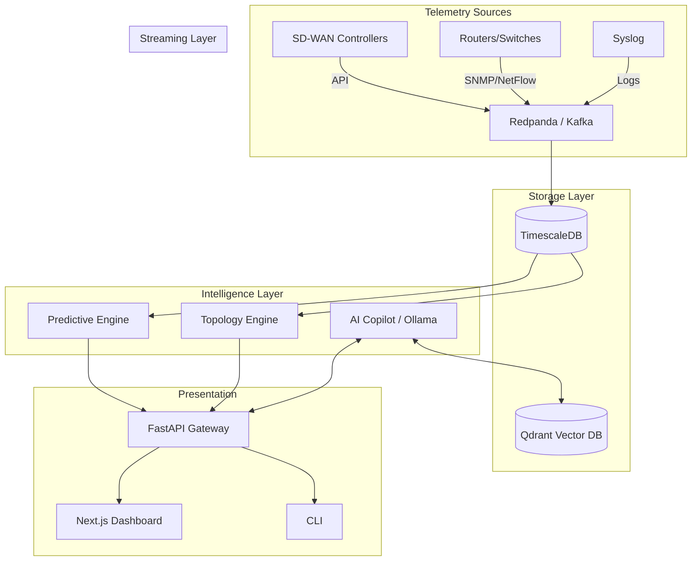

# Plutopus: Master Pitch & Strategic Narrative

> **Category**: AI-Powered Predictive NOC Copilot for SD-WAN/MPLS Networks

---

## 1. Executive Summary

**Plutopus is the world’s first AI-native, air-gap ready predictive Network Operations Center (NOC) Copilot.**

We help mission-critical enterprise networks transition from reactive firefighting to proactive prevention. Unlike traditional monitoring platforms that simply alert engineers after something breaks, Plutopus predicts what will break next, explains why it will happen in plain English, and recommends preventative actions—all before users are impacted.

> [!IMPORTANT]
> **One-Line Positioning**
> Plutopus is a self-hosted, vendor-agnostic AI Copilot that predicts network failures and automates root-cause analysis for modern SD-WAN and MPLS environments.

**Vision**: A future where networks operate autonomously, preventing downtime before it happens, and empowering engineers to focus on strategy rather than support tickets.

**Mission**: To deliver enterprise-grade, predictive network intelligence that is fully explainable, secure by design, and capable of operating in the world's most isolated environments.

---

## 2. The Problem

### Modern NOC Reality

The modern enterprise network is more complex than ever. Organizations have shifted from simple hub-and-spoke models to dynamic SD-WAN architectures layered over legacy MPLS. While these designs offer flexibility, they create catastrophic visibility gaps between the overlay (SD-WAN) and the underlay (physical transport).

For the engineers sitting in the NOC, this reality is a nightmare:
- **Alert Fatigue**: A single fiber cut can trigger thousands of cascading alarms across routing, switching, and application layers. 
- **Reactive Operations**: Current tools are fundamentally backward-looking. They confirm that a branch went offline five minutes ago, forcing teams into a reactive scramble.
- **Manual Triage**: Engineers waste hours manually stitching together SNMP metrics, Syslog events, and BGP tables to figure out the root cause.

In short, NOCs are overwhelmed. The tools designed to help them have become part of the problem.

---

## 3. Cost of the Problem

### The Business Impact of Reactive Networking

When networks fail reactively, the damage is already done. The costs compound rapidly across the organization:

| Impact Area | Hidden & Direct Costs |
| :--- | :--- |
| **Downtime** | Lost revenue during POS/application outages, idle workforce. |
| **SLA Breaches** | Millions in penalties for telecom operators and MSPs failing to meet 99.999% uptime guarantees. |
| **Escalation Costs** | Tier 1 engineers blindly escalating issues to expensive Tier 3 architects because they lack diagnostic context. |
| **Engineer Burnout** | High turnover in NOC teams due to chronic alert fatigue and stressful, high-pressure troubleshooting calls at 3 AM. |
| **Customer Dissatisfaction** | Churn caused by unpredictable application performance and degraded VoIP/video quality. |

---

## 4. Existing Solutions & Market Gap

### Traditional Monitoring (e.g., SolarWinds, PRTG)
Legacy platforms are glorified metric dashboards. They rely on static thresholds (e.g., "Alert if CPU > 90%"). They have no understanding of topology or SD-WAN intent, generating massive noise when large-scale events occur.

### Vendor Ecosystems (e.g., Cisco, Fortinet)
Hardware vendors provide excellent dashboards for their own equipment, but they are walled gardens. An enterprise using Cisco at the branch, Palo Alto at the edge, and legacy MPLS in the core cannot get a unified, predictive view from any single vendor.

### AIOps Platforms 
Most AIOps solutions are essentially cloud-based log aggregators. They are still fundamentally reactive, lack deep specialization in SD-WAN routing protocols, and force enterprises to stream sensitive telemetry to the public cloud—a non-starter for defense, finance, and critical infrastructure.

> [!NOTE]
> **The Missing Category: The Predictive NOC Copilot**
> There is a massive void for a platform that sits above the vendors, operates entirely locally (air-gapped), and uses AI not just to correlate logs, but to **predict and explain** network behavior.

---

## 5. Introducing Plutopus

Plutopus is the intelligence layer for the modern NOC. 

### What It Does
It ingests raw telemetry, maps it to a real-time graph topology, applies predictive analytics to forecast degradation, and uses a localized Large Language Model (LLM) to act as an expert Copilot for engineers.

### How It Works: The Core Loop
1. **Observe**: Ingests telemetry across all vendors.
2. **Predict**: Forecasts tunnel congestion and routing instability up to 60 minutes in advance.
3. **Explain**: Translates complex data into natural language via the AI Copilot.
4. **Recommend**: Surfaces precise runbooks and mitigation steps.
5. **Prevent**: Engineers fix the issue before the users ever notice.

---

## 6. Product Deep Dive

### Telemetry Ingestion Layer
A vendor-agnostic streaming pipeline capable of handling high-throughput telemetry.
- **Protocols Supported**: SNMP, Syslog, NetFlow/IPFIX, and REST API polling from SD-WAN controllers.
- **Architecture**: Powered by a high-throughput Kafka-compatible broker (Redpanda) ensuring zero data loss during major outages.

### Topology Intelligence
A dynamic NetworkX graph model that maintains state for:
- Sites and Roles (Hub vs. Spoke)
- Devices and Interfaces
- Tunnels and Overlays
This ensures that when a core link fails, Plutopus understands the topological blast radius rather than firing 500 isolated alerts.

### Predictive Analytics Engine
Traditional tools use static thresholds; Plutopus uses machine learning.
- **Forecasting**: Predicts latency, jitter, and congestion 15, 30, and 60 minutes ahead.
- **Risk Scoring**: Aggregates predicted anomalies into a unified "Risk Score" (0-100) for every site and tunnel.
- **Time-to-Impact**: Warns operators exactly when a degrading link will drop critical VoIP traffic.

### AI Copilot
An intelligence layer powered by local LLMs (Retrieval-Augmented Generation).
- **Context-Aware**: Knows the exact state of the network at any moment.
- **Explainability**: Translates complex risk scores ("Why is Tunnel-A high risk?") into plain English.
- **Actionable**: Automatically fetches the correct troubleshooting runbook based on the specific failure mode.

### CLI Experience
For the power-user engineer, Plutopus offers a native terminal experience:
```bash
$ plutopus predictions --site NYC-Branch
[WARNING] Tunnel-A predicted to exceed 80% congestion in 15m.

$ plutopus explain --tunnel Tunnel-A
The Copilot says: "Tunnel-A is experiencing a steady increase in jitter. 
Historical patterns suggest a QoS mismatch. Recommend checking queue drops."
```

### Dashboard Experience
A modern, dark-mode React interface designed for large NOC displays.
- **Global Risk Map**: Visual heatmaps of impending failures.
- **Incident Explorer**: Correlated timelines of events leading up to a prediction.
- **Copilot Panel**: A persistent ChatGPT-like interface grounded entirely in the enterprise's private network data.

### Workflow Automation
- Correlates raw anomalies into prioritized "Incidents."
- Recommends the exact playbook to resolve the issue.
- Generates post-mortem incident summaries automatically.

---

## 7. Unique Differentiators

What builds our competitive moat?

1. **Predictive Instead of Reactive**: We don't wait for the red light. We predict it.
2. **Self-Hosted & Air-Gap Ready**: 100% of the platform—including the AI models—runs on-premise. No cloud dependencies. Ideal for defense and highly regulated industries.
3. **Vendor Agnostic**: We monitor the network, not the logo on the box.
4. **Local AI**: We use models like Llama and Mistral via Ollama. No data is sent to OpenAI or third-party APIs.
5. **NOC-Focused**: Designed by network engineers, for network engineers.

---

## 8. Technical Architecture



**Stack Highlights**:
- **Frontend**: Next.js (React), TailwindCSS, TypeScript
- **Backend**: Python FastAPI, SQLAlchemy
- **Data**: PostgreSQL (TimescaleDB for metrics), Qdrant (Vector DB for RAG)
- **AI Stack**: Ollama hosting local LLMs
- **Deployment**: Docker Compose, Kubernetes, fully bundled for offline air-gapped installation.

---

## 9. End-to-End Example: Preventing an Outage

**Scenario**: A subtle bandwidth consumption issue begins at a remote manufacturing branch.

- **Step 1 (Telemetry Collected)**: Redpanda ingests a slight, steady increase in interface utilization and micro-bursting.
- **Step 2 (Prediction Generated)**: The Predictive Engine analyzes the trend and forecasts that bandwidth will max out in 45 minutes, causing VoIP drops.
- **Step 3 (Risk Score Increases)**: The dashboard updates. The branch turns "Orange" (High Risk) on the Global Map. No outage has occurred yet.
- **Step 4 (Copilot Explains)**: The Tier 1 engineer asks the Copilot, *"Why is this branch high risk?"* The Copilot replies, *"Utilization is trending to 100% in 45m due to an unclassified UDP stream."*
- **Step 5 (Actions Recommended)**: Copilot links to the "Rogue Traffic Mitigation" runbook.
- **Step 6 (Engineers Act)**: The engineer applies a QoS policy via the SD-WAN controller.
- **Step 7 (Incident Prevented)**: The risk score drops back to normal. The users never experienced a dropped call.

---

## 10. Market Opportunity

### Timing is Everything
The transition to SD-WAN is largely complete, but Day 2 operations are failing. Enterprises are drowning in alert noise. Simultaneously, LLMs have proven their ability to reason, but enterprises are terrified of sending proprietary network data to the public cloud.

- **TAM (Total Addressable Market)**: The $30B+ IT Operations and Network Management market.
- **SAM (Serviceable Addressable Market)**: The $8B AIOps and Network Observability sector.
- **SOM (Serviceable Obtainable Market)**: Top-tier enterprises, MSPs, and government networks requiring air-gapped, vendor-neutral intelligence.

---

## 11. Target Customers

### Enterprise Networks (Finance, Healthcare, Retail)
- **Pain Point**: Multi-vendor complexity and zero tolerance for downtime.
- **Value**: Unified visibility and reduction in Mean Time To Resolution (MTTR).

### Managed Service Providers (MSPs)
- **Pain Point**: Low margins due to high Tier-1 headcount required to stare at dashboards.
- **Value**: AI Copilot empowers Tier-1 agents to solve Tier-3 problems, drastically improving operational efficiency.

### Government & Defense (Air-Gapped Environments)
- **Pain Point**: Cannot use SaaS tools (e.g., Datadog, ThousandEyes) due to classified network restrictions.
- **Value**: Plutopus provides cutting-edge AI and predictive analytics entirely offline, securely inside the SCIF.

---

## 12. Business Model

Plutopus employs a high-margin, enterprise software licensing model.

- **Enterprise Subscription**: Tiered pricing based on the number of monitored nodes/sites. Includes standard support and updates.
- **Air-Gapped Edition**: Premium tier pricing. Delivered as a hardened, offline installer bundle.
- **MSP Licensing**: Multi-tenant licensing model based on aggregate volume, enabling MSPs to white-label the service.
- **Professional Services**: Custom runbook integration, LLM fine-tuning, and deployment architecture consulting.

---

## 13. Go-To-Market Strategy

- **Phase 1 (Pilot Customers)**: Secure 3-5 mid-market enterprises or regional MSPs for unpaid/discounted pilots to refine the predictive models and gather case studies.
- **Phase 2 (MSP Channel)**: Target mid-sized MSPs. They are highly motivated buyers because reducing ticket escalation directly increases their profit margins.
- **Phase 3 (Enterprise Direct Sales)**: Leverage case studies to sell to CIOs and VP of Infrastructure at Fortune 1000 companies.
- **Phase 4 (Government & Defense)**: Pursue federal contracts emphasizing the unique "local AI" and "air-gap" capabilities.

---

## 14. Competitive Analysis

| Feature | Plutopus | Cisco ThousandEyes | SolarWinds | Generic AIOps (e.g., Moogsoft) |
| :--- | :---: | :---: | :---: | :---: |
| **Predictive Analytics** | ✅ Yes | ❌ No (Reactive) | ❌ No | ⚠️ Partial |
| **Generative AI Copilot** | ✅ Yes | ⚠️ Cloud Only | ❌ No | ⚠️ Cloud Only |
| **Fully Self-Hosted** | ✅ Yes | ❌ SaaS Only | ✅ Yes | ❌ SaaS Mostly |
| **Air-Gap / Offline AI** | ✅ Yes | ❌ No | ❌ No | ❌ No |
| **Vendor Agnostic** | ✅ Yes | ⚠️ Cisco Biased | ✅ Yes | ✅ Yes |
| **SD-WAN Topology Aware** | ✅ Yes | ✅ Yes | ❌ No | ❌ No |

---

## 15. Product Roadmap

- **Phase 1: Telemetry Foundation** (Current) - Robust ingestion of SNMP, NetFlow, and API polling.
- **Phase 2: Prediction Engine** (Current) - Time-series forecasting and risk scoring.
- **Phase 3: Copilot Integration** (Current) - Local LLM RAG capabilities for contextual troubleshooting.
- **Phase 4: Workflow Automation** (Next 6 Months) - Automated ticketing, auto-triage, and ITSM (ServiceNow) integration.
- **Phase 5: Air-Gapped Enterprise** (Next 12 Months) - Hardened deployment packages, advanced RBAC, and audit compliance features.
- **Phase 6: Multi-Vendor Expansion** (Next 18 Months) - Turn-key integrations with 20+ SD-WAN and firewall vendors.

---

## 16. Vision for the Future

Over the next 5 years, Plutopus will evolve from a **Predictive Copilot** to an **Autonomous Network Digital Twin**. 

Imagine a platform that doesn't just recommend a fix to an engineer, but simulates the fix against a digital twin of the network, verifies it won't break anything else, and then applies the configuration automatically. We are building the foundational intelligence for the self-healing, autonomous Enterprise Control Center.

---

## 17. Closing Narrative

> [!TIP]
> **From Reactive Operations to Predictive Intelligence.**

For twenty years, Network Operations has been a game of waiting for the phone to ring. We built faster alarms, bigger dashboards, and louder sirens—but we never actually solved the problem.

Plutopus changes the paradigm. We give networks the ability to see into their own future, and we give engineers the AI tools to prevent the fire before the smoke even appears. 

**The network of tomorrow isn't monitored. It is understood.**

--- 
*Plutopus — Predict the Unpredictable.*
